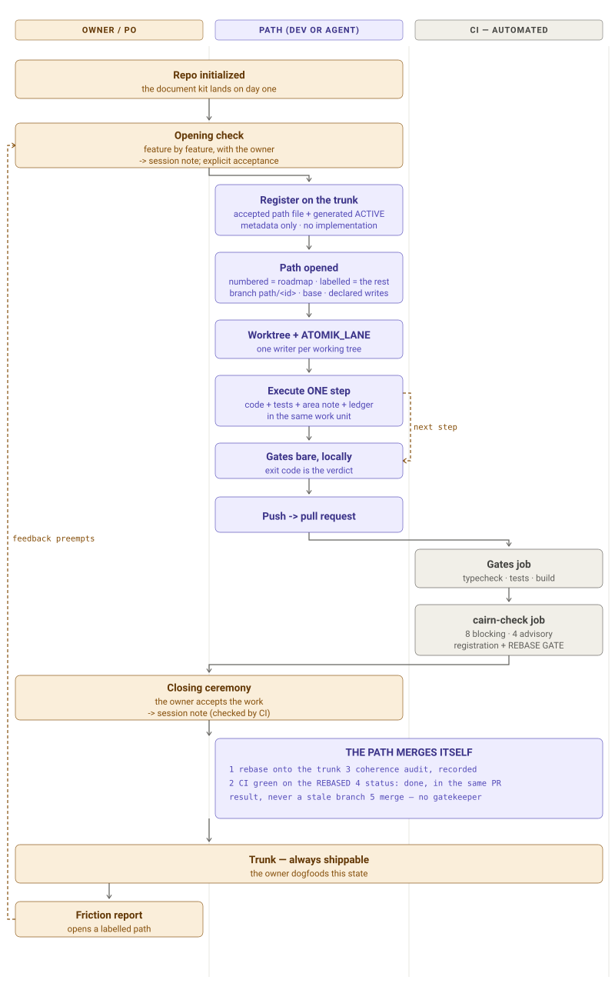

# Historical rationale — parallel coding paths

> **EXPLANATORY HISTORY, NOT THE CURRENT OPERATING ROUTE.** ADR-020 stage 4
> separated the portable convention into [`paths.md`](./paths.md), Atomik's
> commands and examples into [`binding.md`](./binding.md), and the per-session
> protocol into the [Cairn execution reference](../../docs/cairn/specification/reference/execution-protocol.md).
> This page remains unabridged so the required reading can link its rationale
> instead of compressing or deleting it.



**Historical status at capture: ACCEPTED operating detail under ADR-012.** CP-OPS-001 S06 ratified
the model after its first pilot; S08 amends the opening order after real
parallel work exposed the checkout-local visibility hole. Work runs on what is
written here, never on a conversation.

## The model

```text
N coding paths, running at the same time
one path      = one worktree = one branch = one writer
every opening = one registration-only trunk commit BEFORE the branch
every commit  = one immediate remote checkpoint on its owning branch
every step    = one safe boundary between chat sessions
each path merges ITSELF into the trunk
every closure = remote merge verified + clean secondary worktree removed
no integrator, no parent, no gatekeeper
```

An earlier draft put a single integrator between every lane and the trunk. The
owner rejected it (2026-08-14): *"for me it not possible to have only one
integrator, every workstation or dev should be able to merge into master"* —
and was right for a second reason that only became visible afterwards. The
integrator created two of the four holes the workflow audit had found: nothing
marked a lane integrated, and the gate left no artifact. Both vanish when a
path merges itself, because the path sets its own `status: done` in the very
pull request that lands it, and that pull request with its CI run IS the
artifact.

The lane abstraction is gone with it. Paths were always the unit of bounded
work; making them the unit of parallelism removes a layer instead of adding one.

## Naming

```text
CP-MVP-010     numbered  — roadmap work, one per milestone slice
CP-SETTINGS    labelled  — everything else: fine-tuning, repairs,
CP-PROVIDERS               investigations, spikes
```

Numbered paths come from the roadmap and carry a register row. Labelled paths
are named for their subject and do not claim a milestone. Both are ordinary
accepted paths, and both get both ceremonies — the owner's ruling (2026-08-14):
*"ceremonies are short anyway and the only moment the dev actually work with
[the owner]... better too much evaluation than not enough."*

Branch names follow the path: `path/cp-mvp-010`, `path/cp-settings`.

## Opening a path

Drafting and executing happen in the SAME session. Nobody drafts a path for
someone else to pick up later — the owner's observation, and it removes the
handoff the earlier draft assumed.

1. Run the OPENING CHECK with the owner — feature by feature, recorded in a
   session note carrying root-level `path:` and `ceremony: opening` frontmatter
   ([schema](../../docs/bedrock/24_24-doc-templates.md#session-note-and-ceremony-template)).
   Activation needs explicit acceptance, and this is **blocking**: a path file in
   a change that declares `status: running` with no such note fails `cairn-check`
   (owner directive 2026-08-24). Both ceremonies are gated now — the closing half
   guards the merge, the opening half guards the activation, and a path could
   previously be registered, branched and worked with no recorded acceptance at
   all. CP-MVP-011 and CP-MVP-012 are the finite exception, advisory rather than
   blocking, because their real opening notes predate the declared schema and live
   on branches this checkout must not write; each clears itself by adding two keys
   to the note it already has.
2. From a clean, current trunk, create the accepted path file from the template
   in bedrock 24:

```yaml
atomik:
  id: CP-MVP-010
  status: running            # draft | running | done | blocked | archived
  base_commit: 70f7e27
  branch: path/cp-mvp-010    # required by `running`; it is what puts the path
                             # in the generated view and what CI checks against
  writes:                    # ADVISORY — a signal, never a lock
    - apps/desktop/electron-main/graph-index.ts
    - docs/modules/atomik-desktop-graph.md
```

   `base_commit` is the trunk tip immediately BEFORE this registration. Run
   `npm run cairn-active` and `npm run cairn-check`, then land a **metadata-only**
   commit on the trunk (directly or through the host's required short PR): the
   accepted path declaration, the regenerated view, and the opening-check session
   note that justifies the activation. **No implementation of any kind** enters
   this commit. This tiny serialized transition is the price of a durable global
   portfolio: every workstation and CI can now see the path before its branch
   diverges.

   This page previously said *only* the declaration and the view, while bedrock
   24 named the session note too — and the repository's last real registration
   (`9040417`) followed bedrock. `AGENTS.md` requires such a disagreement to be
   reported, and the audit did (2026-08-24, F15). The rule is **metadata-only**,
   not a file count: a count is arbitrary and would fail a legitimate
   registration that also fixed a typo in the agenda it cites, while
   "implementation in a registration commit" is the thing that actually breaks
   the ordering. Settled in
   [ADR-016](../../docs/adr/ADR-016-cairn-enforcement-integrity.md); both pages
   now say it the same way.

   **Status vocabulary.** Settled by
   [ADR-017](../../docs/adr/ADR-017-coding-path-lifecycle.md). `running` means
   "registered on the trunk, then on its own branch and worktree" and requires
   `branch` + `base_commit`. That tuple is what the generated view and CI key on.
   `done` requires a ceremony session note and means accepted, rebased, audited
   and merged — a completion, not an end. `archived` is the single TERMINAL
   state, reached from `done` by demotion and from `running` by abandonment; an
   abandoned path never passes through `done`, because `done` claims a merge that
   did not happen. `draft`, `blocked` and `archived` carry no branch obligations.
   `active` is gone: it was accepted by `schema` and rejected by `branch-path`,
   so a path declaring it failed with a message about a different problem, and
   its reservation for CP-OPS-001 was spent when that path reached `done`.

3. Create the worktree FROM THE REGISTRATION COMMIT and its runtime isolation
   (below). Cairn blocks a new `path/*` branch when its matching `running`
   declaration is absent from the trunk. CP-OPS-001, CP-MVP-011 and CP-MVP-012
   are the finite grandfathered set because they were already running when the
   defect was found; the exemption is named in code and is never copied.
4. Execute bedrock 22's protocol one step at a time — code, tests, docs, the
   ledger and the path-specific handoff brief in the same work unit. Run the
   gates, commit, and push that commit immediately. Only then is the step done.

### Why registration is a commit, not more guidance

`cairn-active` reads files in ONE checkout. Before this rule, a new path file
was first committed on its own branch. The trunk and every sibling branch were
therefore unable to see it; on 2026-08-20 the generated trunk view passed its
freshness check while saying no path was running, although four clean worktrees
declared `status: running`. The view was internally current and globally false.

No instruction can make one Git tree read files that exist only in unrelated
trees. Registration changes where the stable identity tuple lives; derivation
then works as designed. The evolving ledger remains branch-owned.

### `writes:` is advisory

An overlap SIGNAL when the path opens, and a diff-versus-declaration CHECK
before merge. Never a lock. A root cause is discovered, not declared: S07b was
reported as "pills show file names" and fixed in `firstHeadingOf`, rewriting
the strip, the relation sentences and the wikilink candidates in one edit. A
path that must widen records the widening in its ledger and keeps going.

**Declare documentation surfaces too** — they are the ones that actually collide.

## One writer per working tree

A shared working tree has exactly ONE writer. Others may read, diagnose, review
and report there, but simultaneous edits in one filesystem are not made safe by
Markdown.

The owner dogfoods the trunk in the main working tree, so **every code path
takes its own worktree**:

```bash
git worktree add ../4tom1k-cp-mvp-010 -b path/cp-mvp-010 master
cd ../4tom1k-cp-mvp-010
ln -s ../4tom1k/node_modules node_modules
ln -s ../4tom1k/apps/desktop/node_modules apps/desktop/node_modules
```

Branch from local `master`, never `origin/master` when the local branch is
ahead. Run the app with `ATOMIK_LANE=<slug> ATOMIK_LANE_PORT=<port> npm run dev`
so two instances never share one Electron profile (`electron-main/lane.ts`).

## Every commit is a remote checkpoint

Owner directive (2026-08-24): *"push after evry commit so we have an online
log"*. Commit and push are therefore one completion unit:

```text
change code + tests + docs + ledger + handoff brief
  -> run the relevant gates bare
  -> commit the coherent work unit
  -> push immediately to that commit's owning branch
  -> only now report the step complete
```

For implementation work that branch is `origin/path/<id>`. Registration-only
and final merge commits belong to the trunk and are pushed there immediately.
If the push fails, the agent reports **implemented locally, not complete**, puts
the failure in the checkpoint, and does not recommend an ordinary session
handoff. An emergency handoff remains possible when the owner explicitly
chooses it.

`cairn-check` warns when a path HEAD is absent from its configured upstream. It
cannot prove historical cadence once several commits are eventually pushed
together. On GitHub, the repository Activity view records direct pushes and
force-pushes separately from commit metadata; the commit list still shows the
commit's own dates, not a replacement "push date". Treat the remote branch as
the durable checkpoint and Activity as a useful online timeline, not as a
promised permanent audit archive. That is why remote cadence is an absolute
operating rule and an advisory check, not a blocking repository-integrity rule.
See [GitHub's Activity view documentation](https://docs.github.com/en/repositories/viewing-activity-and-data-for-your-repository/using-the-activity-view-to-see-changes-to-a-repository).

If a closing rebase rewrites already-published path commits, publish the
rebased head with `git push --force-with-lease`, never blind `--force`, and
record the pre-rebase and post-rebase heads in the Work Ledger or coherence
audit. GitHub Activity then shows the force-push event, while the final merged
history carries the rebased commits.

## Every completed step is a session boundary

A coding path may span many sessions; a chat should not have to. After every
completed-and-pushed step, the agent proactively offers a fresh-session
boundary. This is a session handoff, **not** a closing ceremony and not a path
status transition.

Before making the offer, the same work unit refreshes
`atomik-project/briefs/<path-id>-handoff.md` from the path ledger. The completion
report names the pushed commit, the gate verdict, the next action, and asks
whether to continue here or start that next action in a fresh session. If the
owner chooses fresh, the current chat ends. A new session opened in the same
worktree identifies the path from its branch, reads `AGENTS.md` -> `paths.md`
-> `ACTIVE.md` -> the path ledger -> its handoff brief, verifies reality, and
continues without asking the owner to reconstruct prior context.

The path file remains primary. If the generated brief and repository reality
disagree, the new session reconciles the ledger and regenerates the brief;
conversation memory never wins.

## Merging — every path merges itself

```text
1  CLOSING CEREMONY — the owner accepts the work, recorded in a session note
                      declaring root-level `path:` + `ceremony: closing`
2  REBASE on the trunk — enforced, not remembered (below)
3  CI GREEN on the rebased result, never on a stale branch
4  COHERENCE AUDIT — recorded, advisory (below)
5  the path sets its own status: done, and merges
6  the pushed merge is verified on the remote trunk; the exact clean
   secondary worktree is removed without force, while its branch is retained
```

Step 2 is what makes a gatekeeper unnecessary. Requiring the branch to contain
the trunk tip serializes the MERGE — thirty seconds — without serializing the
WORK. Two paths run for two days in parallel and still land safely, because
whoever merges second rebases and re-runs CI. There is no queue of people, only
a queue of merges.

### The rebase gate is automated

Owner directive (2026-08-14): *"the rebase need should be an automated gate"*.
`cairn-check` fails when a `path/*` branch does not contain the current trunk
tip. Objective, no judgment, one command to fix — the shape a blocking rule
should have. Configure the host to require it too (GitHub: "require branches to
be up to date before merging") so the rule holds even if someone merges from
the web UI.

### The coherence audit is automated, its verdict is not

Owner directive: *"it could be an automated audit from agent after each rebase
or merge"*. Removing the integrator removes the person who noticed two paths
drifting apart architecturally, so the noticing is delegated to an agent —
without letting a non-deterministic judgment block a merge:

```text
the AGENT produces the judgment     — reads the rebased diff against bedrock,
                                      the ADRs, and the path's declared coverage
CI checks only that it EXISTS       — a deterministic gate on a
                                      non-deterministic activity
its verdict never blocks            — findings are advisory, read by a human
```

`npm run cairn-audit` scaffolds the record; the agent fills it in. One file per
audit under `atomik-project/audits/`, so two paths auditing at once never
conflict.

### Cleanup is the final local transition

The branch is durable history; its worktree is a disposable working copy.
Cleanup happens only after the merge commit has been pushed and verified on
the remote trunk. From the main/owner worktree or another surviving checkout:

```bash
git fetch origin master
git merge-base --is-ancestor <merge-commit> origin/master
git worktree list --porcelain
git -C <exact-secondary-worktree> status --porcelain=v1
git worktree remove <exact-secondary-worktree>
git worktree list --porcelain
test ! -e <exact-secondary-worktree>
```

The status command must print nothing, and the exact target must be a
secondary checkout registered by `git worktree list` for the path that just
merged. Run removal from outside that worktree. Never target the main/owner
worktree, never pass `--force`, and never treat worktree cleanup as permission
to delete the local or remote path branch. The retained branch preserves the
online per-step history requested by the owner.

If remote verification, cleanliness, removal, or the final absence check
fails, report **merge complete; cleanup incomplete** and leave the directory
intact for inspection. This machine-local transition cannot be honestly
enforced by repository CI after the checkout disappears, so it is an absolute
operating rule and a required path-closure report, not a Cairn blocking rule.

## Nothing is shared, so nothing needs a gatekeeper

The integrator's real job was writing the files everyone touched. With no
integrator, those files must stop being shared at all — the same move the lane
list already made, applied everywhere:

```text
ACTIVE.md              GENERATED from the path files (npm run cairn-active)
register status        GENERATED from the same source
root module note       an index over the per-area notes
the journal            ONE FILE PER ENTRY under atomik-project/log/
                       — two paths writing two files never conflict
```

`atomik-project/log.md` is FROZEN as the historical archive (its ~300 entries
are not migrated; rewriting history to fit a new convention would be worse than
the convention). New entries land as `log/YYYY-MM-DD-<path-id>.md`.

What remains genuinely hand-written — bedrock pages, ADRs, per-area module
notes, each path's own file — is per-file by construction, so two paths editing
different ones never meet.

The stable part of each path file is GLOBAL before work starts: its accepted
`id` / `status` / `branch` / `base_commit` tuple is registered on the trunk.
The path branch then owns the evolving checklist and Work Ledger. Without that
ordering, `ACTIVE.md` is only a projection of whichever branches happen to be
ancestors of the current checkout — not a portfolio view.

### The path record is a folder, born sliced

A path record is MANDATORY reading for whoever resumes that path, so its size is
a protocol cost rather than a housekeeping detail. Measured on 2026-08-31 for one
running path: ~23.9 k tokens of cold-resume reading, and the record was half of
it ([ADR-020](../../docs/adr/ADR-020-protocol-context-weight.md)).

A record is therefore a FOLDER from the moment it is registered:

```text
CP-EXAMPLE-001/
  index.md      declaration · step index · live header · next action · blockers
  plan.md       the forward plan, read when planning
  log.md        the OKF folder log
  steps/S01.md  one file per step, written there from the first step
```

- **There is no rollup.** The older convention let a record grow and then cut
  completed steps out of it, verbatim, into `history/`. It worked — CP-OPS-002
  did it twice — but it is a *discipline* fix: it depends on someone noticing an
  advisory and then performing a delicate move correctly. This protocol has three
  times preferred to remove such an operation by construction instead (one
  journal file per entry, a generated `ACTIVE.md`, a registration commit). This
  is the fourth.
- **A step file is written to be read alone.** Deixis — *"the checkpoint below"* —
  is a defect at authoring time rather than a casualty at rollup time.
- **The step-index line in `index.md` is load-bearing**, and it is the design's
  real risk. Slicing saves nothing if a reader cannot decide from that one line
  whether it needs the step file; it then opens several and pays more than
  before. No predicate can check that a summary line is informative, so this is a
  stated writing obligation, measured by cold resume.
- **The Work Ledger dissolves.** A row about one step — `Gates at S08a`,
  `Widening (S05)` — goes to that step, where its `cairn-unit` block already
  carries the machine-readable half of the same fact. What stays in `index.md` is
  the live header: status, base commit, branch, next action, blockers. It does
  not grow.

**A record's identity is the id it declares, not the file that carries it.** The
flat `CP-<id>.md` is the older shape and stays conforming; every rule keys on the
id, so a record migrates between shapes without its registration, its lifecycle
or its history appearing to restart. A step record stays append-only wherever it
sits: it may be RELOCATED — links repointed, text appended — and `cairn-check`
tells that apart from a rewrite by normalising link targets away and requiring
the old text to be a prefix of the new.

`cairn-check` still reports `ledger-size` when a **flat** path record in the diff
exceeds 10,000 tokens (`LEDGER_TOKEN_BUDGET`). It is retired when the last flat
record migrates, and not before — until then it is the only signal a record that
has not been sliced ever gets. Diff-scoped on purpose: a corpus sweep would report
the same historical files on every run for months, and a check that cries wolf is
a check people switch off.

CP-OPS-002 is the migrated proof (S08l): one 21.2 k-token file became a folder
whose required reading is `index.md`, with thirty-nine step records beside it and
a seventy-four-row Work Ledger distributed to the steps it described. CP-MVP-008
is the older proof of the older convention: ~23.5 k tokens to ~4.7 k, with its
seven step records still under [`history/`](./history/index.md).

### Hot files that still conflict

`apps/desktop/electron-main/index.ts` (~1900 lines) and
`shared/ipc-contract.ts` (~870): every path adding an IPC channel touches both.
Frequent conflicts, MECHANICAL resolution (two paths appending distinct
channels). Rebase early and often; do not paper over it with bookkeeping.

## Enforcement — `cairn-check`

```bash
npm run cairn-check                            # on a path/* branch: the branch
                                               # vs the trunk, as CI sees it
npm run cairn-check -- --working-tree          # narrow it to uncommitted work
npm run cairn-check:test                       # the validator's own tests
```

The default is the **merge-deciding** comparison, and that is a correction. The
two commands used to ask different questions of one tree — the working tree
against `HEAD` locally, the branch against the trunk in CI — so every rule that
evaluates *changed files* saw a different set depending on who ran it. On
`path/cp-ops-002` the local run reported `OK` over 0 changed files for many
pushes while CI reported nine blocking findings over 224. Both answers were
correct; only one of them decided the merge, and it was the one nobody ran
locally (CP-OPS-002 S08, finding 5).

Narrowing is still available and is now an opt-out rather than the default. A
narrowed run announces itself with the advisory `base-parity`, so a ledger
cannot record a narrow verdict as if it were the full one — the same reason the
`--base` ref and its origin are printed in the header line.

```text
BLOCKING   branch → path (a path/* branch is declared by a running path
                          carrying a base_commit)
           trunk registration — that accepted running declaration already
                          exists on the trunk before implementation starts
           rebase gate — a path branch contains the trunk tip
           a path marked running has an opening-check session note
           a path marked done has a closing-ceremony session note
           source changed ⇒ a module note AND a coding path changed
           path AND ADR frontmatter parse, statuses in vocabulary,
                          an ADR id matching its file and its two halves agreeing
           relative links in docs/ and atomik-project/ resolve
           derived views current — in EVERY checkout, not only the trunk
           a path reaching done is declared by a journal entry
           a record this change adds carries one date, not two that disagree

ADVISORY   base parity — a path-branch run compared the working tree with
                          HEAD instead of the branch with the trunk
           coherence audit missing for this head
           remote checkpoint — path HEAD is not yet on its upstream branch
           scope drift vs declared writes:
           record date — a record's date is far from the commit that wrote it
           ledger size — a path file in the diff is over its token budget
           path staleness — a running path's branch has gone quiet past the
                          declared window; push the work, or archive the path
           area note untouched while its source changed
           bedrock changed with no ADR beside it
```

**The test a rule must pass to block:**

```text
objectively checkable   AND   breaking it leaves something WRONG IN THE REPO
                              — not merely unconventional
```

Undocumented code is wrong. A journal entry written by the path that did the
work is unconventional. Only the first fails a build. The journal rule was
briefly blocking and was retracted when it failed this test.

Advisory findings print and never fail the build. A validator that blocks on
judgment calls gets switched off within a week — and the first run of this one
reported 34 broken links that were not broken (bedrock pages illustrating a
vault layout inside code fences). **A false blocking verdict costs more than a
missed one.**

CI runs it as a job SEPARATE from the gates, because "does the software work"
and "was the protocol followed" are two different questions and a team needs to
see which one failed (`.github/workflows/cairn.yml`).

## Owner feedback preempts

```text
owner uses the trunk
  -> reports friction
  -> pin the exact commit + vault/artifact/configuration
  -> open a short LABELLED path
  -> reproduce, add a regression test
  -> integrate as soon as its gates are green
  -> longer paths rebase onto it at their next step boundary
```

This ratifies what the repository already did: S06b, S07b and S07c all preceded
S08.

## Holes still open

The workflow audit (drawing D14) found four missing guards. Self-merge closed
two of them by construction. Checkpoint drift was discovered later, and the
abandoned-path hole closed at CP-OPS-002 S07a, so **two** open holes remain:

1. **`base_commit` accuracy is unchecked** — presence is verified, truth is not.
   Partly mitigated by the rebase gate, which checks the branch against the
   trunk directly rather than trusting the recorded base.
2. **Checkpoint accuracy is unchecked.** The validator verifies that a path file
   CHANGED when source changed; it cannot tell whether the checkpoint inside it
   is still true. Found the honest way, on 2026-08-15: CP-OPS-001's own
   checkpoint still described step zero in lane vocabulary five steps after the
   lane layer was removed. The rule the protocol most depends on is the one it
   cannot mechanically defend, because "is this prose still accurate?" is not a
   checkable question. Candidate mitigation, no more than that: require the
   checkpoint's `base commit` line to match the branch's actual base.

Closed by CP-OPS-002 S07a (2026-08-25): **abandoned paths had no terminal
status**, so a path that died kept `status: running` and poisoned the generated
views. [ADR-017](../../docs/adr/ADR-017-coding-path-lifecycle.md) gives
abandonment the transition `running → archived` — the same shelf a finished path
is demoted to, with no fifth word added — and adds the advisory `path-staleness`
finding for the other half of the hole: a `running` path whose branch has had no
commit for longer than the declared window (14 days) is reported, with the two
ways out. Advisory permanently, because a parked path is not a wrong path and a
build that failed for one would teach people to lie about status rather than to
archive. A branch this checkout cannot resolve reports nothing: unknown must
never read as stale.

Closed by CP-OPS-001 S08 (2026-08-20): **running-path visibility**. Deriving
`ACTIVE.md` from path files did not help when the files existed only on sibling
branches. The accepted declaration now lands on the trunk before branching,
and a new blocking rule checks that fact. Guidance alone could not repair a
missing Git ancestor.

## Questions still open after the pilot

- What is the minimal path status lifecycle beyond `running` / `done`?
- How precise must a declared write surface be before it stops being useful?
- Should an investigation path be an accepted path even when its output is
  intentionally disposable?
- Does the coherence audit find anything a human would not have? If it does not
  after the pilot, delete it rather than keep it as decoration.
