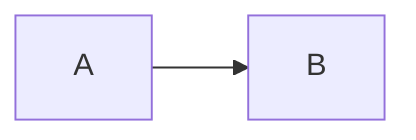

# CP-RICH-MARKDOWN S04 Mermaid

## Result

S04 connects locally pinned Mermaid 11.16.1 to the S02 registry for read and
live Markdown without changing authored bytes or adding renderer authority.
Successful `mermaid` fences become accessible static SVG; invalid, unsafe,
oversized, timed-out, cancelled, or unavailable output returns to escaped
source with the host's text diagnostic.

S05 is now active. It will reuse the SVG postflight for inline-data-only
Vega-Lite and add view finalization.

## Implementation shape

- `registry.ts` has one static dynamic-import target for the tiny Mermaid
  adapter module. No Mermaid import enters the eager graph.
- `mermaid-core.ts` keeps policy testable without loading the real package. It
  owns hard source/text/edge/output caps, active/resource syntax rejection,
  immutable strict config, Atomik token palettes, global config/render
  serialization, off-screen staging, cancellation, and cleanup.
- `safe-svg.ts` is renderer-neutral. It parses the returned string and rejects
  DTD/entity/processing-instruction input, foreign namespaces, scriptable or
  resource/animation elements, base URLs, non-fragment URI/CSS targets,
  active or escaped CSS, and duplicate IDs. It strips event/navigation
  attributes, namespaces every ID, rewrites targeted fragment references,
  preserves/adds accessible title/description, and imports a DOM node.
- Hydration request IDs now include a monotonically increasing mount
  generation. Identical diagrams in two mounted notes therefore cannot share
  marker/filter/clip/accessibility IDs; the request ID is also Mermaid's
  deterministic seed.
- Live preview generalizes the disposable math widget to math + Mermaid. Both
  use the same hydrator/theme facet, replace only untouched ranges, reveal raw
  source on touch/click, and share the 128-block cap.
- Diagram output sits on the opaque token surface, stays responsive and
  scrollable, and suppresses authored animation under reduced motion.

## Security invariants proved

```text
startOnLoad              false
securityLevel            strict
htmlLabels               false
suppressErrorRendering   true
deterministicIds          true
maxTextSize              <= 20,000
maxEdges                 <= 200
arrowMarkerAbsolute      false
bindFunctions            never called
renderer network         no admitted source/output target
raw SVG string sink      none on the note surface
```

Init/YAML configuration and click/link directives are rejected even though the
same keys are also locked in Mermaid's `secure` list. Image shapes, Markdown
images, raw resource tags, URL CSS, absolute/protocol-relative schemes, and
common relative-link doors fail before render. A caller can lower a budget but
cannot raise the hard ceilings.

The global Mermaid site config cannot safely serve concurrent themes/seeds
without serialization. A deferred two-request test proves request two cannot
update config until request one has completed. Abort removes staging
immediately; publication checks the signal after Mermaid and after SVG parse.

## Runtime package smoke

The pinned real package was imported and called directly against a headless DOM
with only the DOM measurement primitives absent from LinkeDOM polyfilled
(`CSSStyleSheet`, `getBBox`, `getComputedTextLength`). The ordinary strict
flowchart:



returned:

```text
diagramType       flowchart-v2
serialized SVG    11,973 characters
foreignObject     absent
external href     absent
```

The emitted element vocabulary was static SVG (`defs`, filter/gradient/marker,
shape, text and style nodes); URL-bearing attributes were fragment-local.
Production Chromium supplies the polyfilled headless primitives natively.

## Verification

Focused gate:

```text
tests/note-markdown.test.ts    19 passed
tests/live-preview.test.ts     37 passed
tests/rich-markdown.test.ts    27 passed
total                           83 passed
typecheck                       pass
```

Bare integrated gate:

```bash
npm run cairn-check && npm run typecheck && npm test && npm run build
```

Result:

```text
cairn       PASS — expected closure-only coherence-audit advisory
typecheck   PASS
tests       PASS — 75 files / 965 passed + 1 skipped
build       PASS — 2,354 renderer modules transformed
```

Focused coverage includes strict config/secure keys, initialization once,
global queue isolation, dark/light token mapping, hard limit non-bypass,
edge/source floods, directives/resources, cancellation and staging cleanup,
output caps, event removal, DTD/entity/PI/base/foreign/script/image rejection,
fragment-only CSS/href, color-vs-ID rewriting, duplicate-free generation IDs,
authored/generated accessibility, no bindings, read hydration, live theme/
source reveal, shared cap, and ordinary unknown-fence parity.

## Production output

| Asset | S04 bytes | Delta from S03 |
| --- | ---: | ---: |
| eager renderer entry | 2,383,165 | +1,114 |
| global renderer CSS | 135,772 | +911 |
| Mermaid core (lazy) | 1,097,914 | new lazy chunk |
| flowchart definition (lazy) | 102,800 | new lazy chunk |
| KaTeX CSS | 28,946 | unchanged lazy asset |

Mermaid preserves its own per-diagram splitting: flowchart, sequence, Gantt,
state, ER, pie, architecture and other definitions are separate dynamic
targets rather than one eager payload. The shared KaTeX pin prevents a second
KaTeX runtime. Vega/Vega-Lite and Shiki still do not enter the eager bundle.

The entry is +53,667 B from the S01 2,329,498 B baseline, still well inside the
+150 KiB closure ceiling.

## Deferred deliberately

- Real owner visual/keyboard/screen-reader and rapid theme/cancellation benches
  remain S07/S08; this step supplies deterministic headless contracts.
- Vega-Lite schema/data-loader policy and `View.finalize()` belong to S05.
- Broad code highlighting and decoration-only feedback remain S06.
- No worker was added. Mermaid's own async render cannot be preempted halfway;
  the host times out visibly, detaches staging, suppresses late publication,
  and keeps the adapter queue closed until the global render actually settles.
