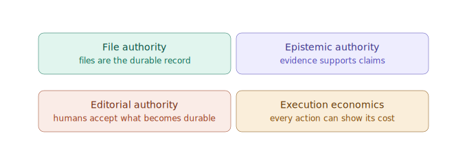

---
{
  "id": "00-orientation",
  "title": "Orientation: Atomik Bedrock",
  "status": "foundational",
  "tags": [
    "product",
    "north-star",
    "bedrock",
    "okf",
    "git",
    "truth",
    "evidence",
    "verification",
    "retrieval",
    "local-inference",
    "cost-observability"
  ],
  "relations": [
    {
      "to": "01-workbench-first",
      "kind": "prioritizes"
    },
    {
      "to": "02-learning-loop",
      "kind": "defines"
    },
    {
      "to": "04-file-first-model",
      "kind": "grounds"
    },
    {
      "to": "26-okf-agent-context",
      "kind": "extends-context"
    },
    {
      "to": "27-git-compatibility",
      "kind": "versioned-by"
    },
    {
      "to": "17-self-evolving-docs",
      "kind": "requires"
    },
    {
      "to": "28-truth-evidence-model",
      "kind": "defines-trust-model"
    },
    {
      "to": "29-verification-grounding-router",
      "kind": "routes-verification-through"
    },
    {
      "to": "31-truth-lens-ux",
      "kind": "surfaces-trust-through"
    },
    {
      "to": "33-retrieval-local-execution-cost",
      "kind": "defines-execution-economics-through"
    }
  ],
  "agent": {
    "purpose": "Keep every implementation aligned with the local-first, file-first, evidence-aware, cost-observable, OKF-compatible workbench thesis.",
    "inputs": [
      "user learning goals",
      "project folders",
      "local files",
      "raw sources",
      "source dossiers",
      "source selections",
      "AI operations",
      "claims",
      "evidence records",
      "verification reports",
      "execution policy",
      "operation budgets",
      "action traces"
    ],
    "outputs": [
      "durable Markdown notes",
      "Markdown source dossiers",
      "project bundle updates",
      "patch proposals",
      "context packs",
      "future scenes and canvases",
      "truth-aware response bundles",
      "claim/evidence records",
      "verification and repair patches",
      "operation receipts",
      "cost and privacy traces"
    ],
    "invariants": [
      "Workbench usefulness comes before DSL/canvas sophistication.",
      "Files are the durable source of record; evidence determines epistemic support.",
      "Project folders are durable thinking spaces, not hidden database objects.",
      "Raw sources are preserved as assets; digested knowledge becomes Markdown.",
      "AI proposes changes; users accept or edit them.",
      "Factual, interpretive, analogical, and normative content must remain distinguishable when it matters.",
      "Docs are part of the product, not an afterthought.",
      "Retrieval is strategy-pluggable and is not synonymous with embeddings.",
      "Every meaningful operation can expose execution location, resource use, privacy boundary, and cost.",
      "Local execution removes external billing but not latency, compute, memory, energy, or maintenance cost.",
      "Persisted, accepted knowledge is paid-for capital; Atomik proposes reuse before regeneration."
    ]
  }
}
---

# Orientation: Atomik Bedrock

> Atomik is a local-first AI learning workbench that turns sources into durable, inspectable Markdown knowledge, exposes how important claims are supported, and later grows that knowledge into relations, visual scenes, canvases, and agent-navigable project memory.

## The corrected north star

The immediate product is not the DSL. It is not the canvas. It is not a complete learning OS on day one.

The immediate product is:

```text
a minimalist desktop workbench
where I can open a project folder,
open many sources and notes,
split them into panes,
select anything,
ask AI for explanation or transformation,
preview the resulting file patch,
and save useful outputs as durable local Markdown files.
```

The long-term product remains larger:

```text
raw source
  -> source dossier
  -> selection
  -> AI operation
  -> claim / evidence / uncertainty
  -> optional verification
  -> durable note / extract / trail / decision
  -> relation
  -> scene
  -> canvas
  -> curation
```

But the first useful loop is shorter:

```text
project -> source or note -> selection -> AI explanation + evidence status -> Markdown patch
```

That first loop must be usable as early as possible, because Atomik should accelerate the learning and architectural thinking needed to build Atomik itself.

## What must survive this chat

This bedrock bundle is the current durable source of record for the reboot. If future discussions conflict with it, update the files explicitly instead of relying on memory.

The project should never depend on hidden chat history as the only place where a decision exists. Important ideas must be promoted into project files: notes, source dossiers, `index.md`, `log.md`, ADRs, context packs, or module learning notes.

## Product promise

Atomik should become the best place to learn, explore, explain, absorb, structure, question, verify, version, and revisit knowledge without constantly switching between browser, PDF reader, chat app, editor, notebook, canvas, and file manager.

## Founding invariant

```text
Every raw source can become a source dossier.
Every source or note can become a selection.
Every selection can become an AI operation.
Every AI operation can become a reviewable durable file patch.
Every meaningful retrieval, transformation, generation, transcription, verification, and patch action can expose an inspectable operation receipt.
Every important factual claim can expose evidence, verification state, freshness, uncertainty, and repair history.
Every durable file can later become a relation, scene, canvas node, or agent context entry.
Every project folder can be navigated by humans, Git, and agents without Atomik running.
Every implementation task can be resumed from a durable coding path without any chat history.
```

## Design stance

Atomik is:

```text
file-first, not database-first
workspace-aware, not tree-only
OKF-compatible, not OKF-limited
Git-compatible, not Git-dependent
AI-assisted, not AI-owned
retrieval-strategy-pluggable, not embeddings-mandatory
local-capable, not cloud-dependent
cost-observable, not token-blind
evidence-aware, not confidence-theater
challenge-native, not authority-by-fluency
```

## Execution economics iteration

Atomik should choose the cheapest sufficient path for each action rather than routing every task through a large cloud model.

```text
existing accepted vault note (reuse before regeneration)
  -> direct file read / deterministic tool
  -> lexical, link, and structural retrieval
  -> optional local embedding or reranking model
  -> local generative model when adequate
  -> cloud model or live web verification when capability or freshness requires it
```

The choice must remain visible and reversible. Model names, benchmark claims, prices, and device assumptions are dated implementation inputs, not timeless architecture.

```text
local != free
cloud != automatically better
more context != better context
retrieval relevance != epistemic support
regenerated != free when the vault already holds it
```

Every meaningful action should be able to emit a privacy-aware receipt covering execution location, model or tool identity, tokens or other work units, latency, external billing, local resource use when measurable, and whether the result was accepted or useful. Raw prompts and note contents are not recorded by default.

## Truth iteration



The phrase “files are the source of truth” is now narrowed to software architecture. Files determine the durable project state. They do not make their contents factually correct.

```text
files = durable source of record
evidence = support for a claim
verification = a dated procedure that tests support
human acceptance = editorial choice
```

Atomik should not promise an infallible model. It should make important claims source-linked, challengeable, freshness-aware, and repairable. The first useful slice is not a full knowledge graph: it is an AI response that can distinguish source-backed, model-only, needs-citation, web-checked, and interpretive content, then let the user inspect evidence and accept a correction as a clean patch.
