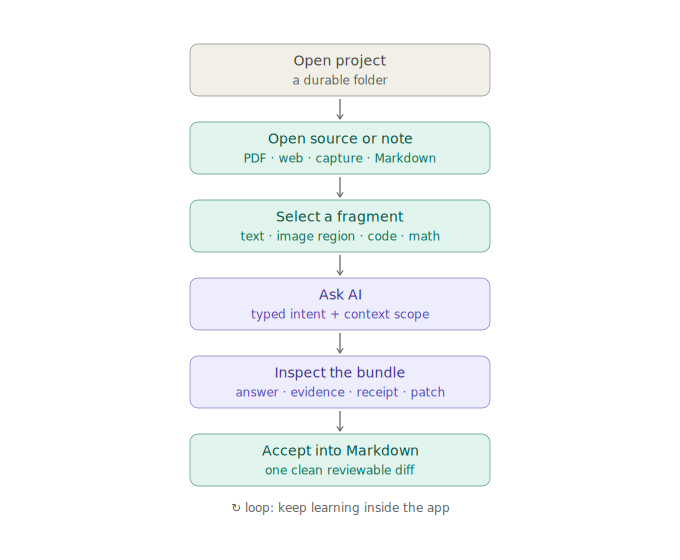
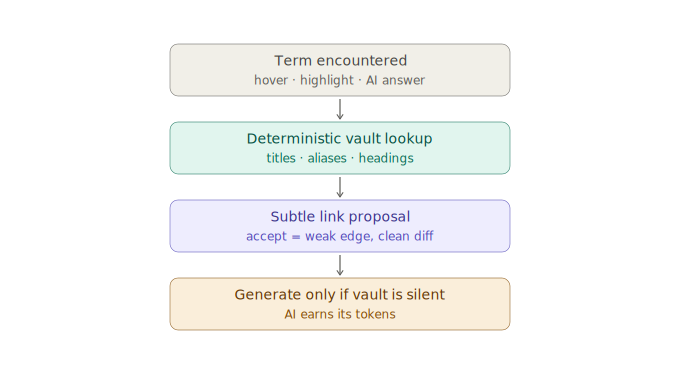

---
{
  "id": "02-learning-loop",
  "title": "The learning loop",
  "status": "foundational",
  "tags": [
    "learning",
    "process",
    "acceptance",
    "context",
    "truth",
    "verification",
    "repair",
    "execution-cost",
    "operation-trace"
  ],
  "relations": [
    {
      "to": "05-resource-selection-model",
      "kind": "formalizes"
    },
    {
      "to": "06-ai-patch-pipeline",
      "kind": "transforms"
    },
    {
      "to": "07-source-adapters",
      "kind": "starts-with"
    },
    {
      "to": "11-markdown-page-model",
      "kind": "writes-to"
    },
    {
      "to": "26-okf-agent-context",
      "kind": "scales-through"
    },
    {
      "to": "28-truth-evidence-model",
      "kind": "adds-epistemic-loop"
    },
    {
      "to": "29-verification-grounding-router",
      "kind": "routes-checks-through"
    },
    {
      "to": "31-truth-lens-ux",
      "kind": "supports-challenge-repair"
    },
    {
      "to": "33-retrieval-local-execution-cost",
      "kind": "measures-actions-through"
    }
  ],
  "agent": {
    "purpose": "Use the loop as the acceptance lens for features and implementation tasks.",
    "inputs": [
      "project scope",
      "source selection",
      "user instruction",
      "existing note context",
      "index/log/context files"
    ],
    "outputs": [
      "explanation",
      "Markdown patch",
      "new note",
      "source dossier update",
      "trail update",
      "context pack update",
      "future relation or scene",
      "claim/evidence bundle",
      "verification report",
      "repair patch",
      "action trace",
      "operation receipt"
    ],
    "invariants": [
      "A feature must help open, understand, transform, structure, revisit, or version knowledge.",
      "Outputs should become more durable and structured than inputs.",
      "The app must not trap knowledge in hidden runtime state.",
      "An agent should be able to re-enter the project by reading files, not by needing chat history.",
      "Important errors and uncertainty should become inspectable and repairable rather than hidden by fluent prose.",
      "The cost and execution path of a meaningful action should be inspectable.",
      "Accepted usefulness is measured separately from raw token volume."
    ]
  }
}
---

# The learning loop

## Short loop for the first MVP



```text
open project
  -> open source or note
  -> select fragment
  -> ask AI
  -> inspect answer, claim/evidence status, operation receipt, and patch
  -> optionally verify or challenge an important claim
  -> insert or create Markdown note
  -> save locally
  -> optional Git diff/commit outside or inside Atomik
```

## Source digestion loop

```text
raw source asset
  -> source dossier in source.md
  -> extracted text / transcript / quotes as Markdown
  -> user-owned note or synthesis
  -> provenance back to source dossier and anchor
```

Sources are unconsumed material until they are read, extracted, quoted, transcribed, annotated, or transformed. The consumed result becomes the user's knowledge and should live in Markdown.

## Reuse loop



Persisted knowledge is paid-for capital — paid in tokens, verification queries, and the user's own correction effort. Regenerating what the vault already holds is economic and epistemic waste: the existing note carries its accepted status, evidence anchors, and repair history, while a fresh generation is model-only content awaiting re-verification.

```text
term encountered (hover / highlight / AI answer)
  -> deterministic vault lookup: note titles, aliases, headings
  -> subtle proposal: link to or open the existing note
  -> accepted proposal = weak edge + clean one-line diff
  -> only when the vault is silent or insufficient
       -> AI generation earns its tokens
```

The vault is rung zero of the ladder for knowledge questions, not only for file operations.

## Full future loop

```text
project bundle
  -> source
  -> view original
  -> select / ask / explain
  -> inspect claims, evidence, interpretation, and uncertainty
  -> verify or challenge when justified
  -> extract durable atomic notes
  -> connect notes with links and typed relation claims
  -> generate Atomik DSL scenes
  -> compose notes, sources, and scenes into canvases
  -> curate weak, duplicated, unsourced, or overgrown knowledge
  -> update index.md, log.md, and context packs
```

## Large-context loop

A long-running project should not depend on one conversation window.

```text
agent enters project
  -> reads project/index.md
  -> reads local index.md files only as needed
  -> checks log.md for recent changes
  -> follows relevant links and source references
  -> retrieves within the selected scope
  -> proposes patches to notes, source dossiers, decisions, logs, or context packs
```

This is not merely summarization. It is navigable project memory.

## Feature acceptance questions

A feature is useful if it answers at least one of these:

```text
Does it help open a project or source?
Does it help focus on a fragment?
Does it help AI explain or transform the fragment?
Does it help write durable Markdown knowledge?
Does it preserve provenance?
Does it show whether important content is fact, interpretation, analogy, or value judgment?
Does it let the user inspect, verify, challenge, or repair a claim?
Does it improve project navigation through index.md, log.md, links, or trails?
Does it produce a clean human-reviewable diff?
Does it help connect or revisit knowledge?
Does it prepare future relations, scenes, or canvases without forcing them early?
Does it surface or reuse existing vault knowledge before paying for regeneration?
```

## Key product difference

Atomik is not a chat app attached to files. The AI interaction should be **selection-native**, **scope-aware**, and **patch-oriented**.

Bad:

```text
generic chat -> answer trapped in conversation -> copy manually somewhere
```

Better:

```text
selected source passage -> AI operation -> proposed file patch -> accepted durable note
```

Best future shape:

```text
project scope + selected fragment + agent navigation over files
  -> truth-aware response bundle with claims, evidence, uncertainty, and optional verification
  -> patch to Markdown/source/log/context
  -> clean diff
```

## Truth and repair loop

```text
generated statement
  -> classify claim nature and scope
  -> map local evidence
  -> mark unsupported or interpretive content
  -> verify only when risk/freshness justifies it
  -> show contradiction or insufficient evidence honestly
  -> propose repair
  -> user accepts/edits/rejects
  -> durable note + verification history + clean diff
```

“Insufficient evidence” is a legitimate learning result. The loop should not force every question into a confident answer.


## Revisit and retention (reserved)

Atomik models sources, claims, and cost with care, but nothing yet brings a note back to the learner. Reading and understanding decay. A future review queue is deliberately deferred — and deliberately reserved: it is a rebuildable projection over notes, `questions.md`, trails, and lifecycle states, requiring zero new canonical objects. Do not build spaced repetition now; do not forget that the seam exists.

## Execution and cost loop

Every meaningful operation follows a second, quieter loop:

```text
intent
  -> choose direct / deterministic / local model / cloud model / web path
  -> apply privacy and budget policy
  -> execute with cancellation and hard limits
  -> emit ActionTrace
  -> inspect result and receipt
  -> accept, edit, reject, or retry differently
```

The useful unit is not merely “tokens consumed.” Atomik should eventually compare resource use with outcomes such as accepted characters, accepted patches, corrected transcript minutes, source anchors opened, or claims successfully verified. A cheap rejected result can be more expensive than a larger accepted one.
