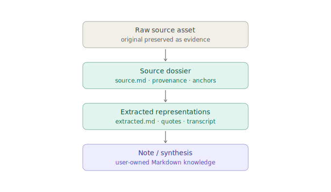

---
{
  "id": "04-file-first-model",
  "title": "File-first, OKF-compatible workspace model",
  "status": "foundational",
  "tags": [
    "files",
    "vault",
    "durability",
    "workspace",
    "project-bundle",
    "okf",
    "git",
    "truth",
    "evidence",
    "claims",
    "retrieval",
    "operation-trace",
    "execution-cost"
  ],
  "relations": [
    {
      "to": "03-workspace-tabs",
      "kind": "separates-ui-state-from"
    },
    {
      "to": "05-resource-selection-model",
      "kind": "opens-resources-from"
    },
    {
      "to": "07-source-adapters",
      "kind": "stores"
    },
    {
      "to": "11-markdown-page-model",
      "kind": "uses"
    },
    {
      "to": "26-okf-agent-context",
      "kind": "enables"
    },
    {
      "to": "27-git-compatibility",
      "kind": "versioned-by"
    },
    {
      "to": "17-self-evolving-docs",
      "kind": "documents"
    },
    {
      "to": "28-truth-evidence-model",
      "kind": "distinguishes-record-from-epistemic-support"
    },
    {
      "to": "30-public-knowledge-dictionary",
      "kind": "hosts-knowledge-packs"
    },
    {
      "to": "33-retrieval-local-execution-cost",
      "kind": "stores-derived-state-and-receipts-for"
    }
  ],
  "agent": {
    "purpose": "Preserve local files as the durable source of record while adding project workspaces, evidence-aware claims, raw sources, source dossiers, trails, context packs, and Git-friendly diffs.",
    "inputs": [
      "filesystem tree",
      "project folder",
      "raw source import",
      "source dossier",
      "AI patch",
      "agent context request",
      "Git diff"
    ],
    "outputs": [
      "project bundle",
      "Markdown note",
      "Markdown source dossier",
      "asset file",
      "trail file",
      "context pack",
      "cache/index entry"
    ],
    "invariants": [
      "Files remain the durable source of record; saving content does not make it epistemically true.",
      "A project workspace is a durable folder, not a hidden database object.",
      "Raw source assets are preserved; digested knowledge becomes Markdown.",
      "Source dossiers are Markdown-first; machine sidecars are optional support files.",
      "Material uncertainty, dispute, or missing evidence cannot exist only in a hidden sidecar.",
      "UI workspace state is recoverable and not canonical knowledge.",
      "Indexes, embeddings, RAG stores, and local public-knowledge indexes are rebuildable from source records.",
      "Agent context packs are generated from durable project files and can be inspected before use.",
      "OKF compatibility is additive and permissive, not a forced schema for every Atomik object.",
      "Git compatibility is a design constraint; opening Atomik must not create noisy rewrites.",
      "Private ActionTrace ledgers and model/index files are operational state, not canonical knowledge.",
      "Reviewed aggregate usage reports may become durable files only through explicit export."
    ]
  }
}
---

# File-first, OKF-compatible workspace model

## Principle

```text
Files are the durable source of record.
Evidence determines epistemic support.
Project folders gather active thought.
Raw sources are preserved.
Digested source knowledge becomes Markdown.
Indexes are conveniences.
Rendered artifacts are rebuildable.
Workspace layouts are UI state.
Agent context packs are generated artifacts, not hidden memory.
Git diffs should be meaningful.
```

The earlier file-first model is correct, but incomplete. Atomik should not expose only a raw vault skeleton. The user needs a **working directory** for a current subject: a place where PDFs, web pages, captures, notes, questions, trails, decisions, and synthesis files sit together.

The correction is:

```text
File-first does not mean tree-only UX.
File-first means every important object behind the richer workspace UX survives as inspectable files.
```

## Four layers

```text
Vault
  the local root and long-term library

Project bundle / subject workspace
  a durable folder for one active area of thinking

App workspace state
  current tabs, panes, scroll positions, pinned resources, and active selections

Indexes / context / RAG
  derived structures that help retrieval and agent context, but can be rebuilt
```

Do not confuse project bundles with app workspace state:

```text
project bundle = durable knowledge context
app workspace = recoverable UI layout
```

## Source material ladder



Atomik should model sources as a ladder, not as one flat record:

```text
raw source asset
  = unconsumed material / evidence / original object

source dossier
  = Markdown description of the source, extraction state, provenance, anchors, links

extract / quote / transcript / reader text
  = digested representation of the source in Markdown

note / synthesis / decision
  = transformed and augmented knowledge that now belongs to the user
```

So the canonical source object should be Markdown-first:

```text
source.md         canonical source dossier
original.pdf      preserved raw asset
extracted.md      extracted text if available
quotes/*.md       interesting excerpts promoted to Markdown
anchors.json      optional precision sidecar when Markdown is not enough
```

The remaining exceptions are narrow:

```text
some originals are not Markdown
some precise anchors need coordinates, offsets, or time ranges
some performance indexes need machine-readable caches
```

Those exceptions support the knowledge files; they do not replace them.

## Project bundle / working directory

A project bundle is the abstraction the user is asking for: a shared folder that gathers thought around a subject without abandoning file-first durability.

Example:

```text
vault/
  projects/
    ai-formation/
      index.md
      log.md
      project.atomik-project.json
      questions.md
      synthesis.md

      notes/
        index.md
        attention-qkv.md
        scaling-dot-product-attention.md

      sources/
        index.md

        pdf/
          attention-is-all-you-need/
            index.md
            source.md
            original.pdf
            extracted.md
            quotes/
              scaled-dot-product-attention.md
            anchors.json        # optional precision/performance sidecar

        web/
          visual-transformers-guide/
            index.md
            source.md
            snapshot.html
            reader.md

        captures/
          2026-06-14-handwritten-attention/
            index.md
            source.md
            original.jpg
            transcript.md

      trails/
        index.md
        transformer-reading-path.md

      context/
        index.md
        current-brief.md
        agent-handoff.md
        selected-sources.md
        recent-decisions.md
        open-questions.md

  .atomik/
    workspace.json
    local-workspace.json
    cache/
    index/
    embeddings/
```

## Project manifest

The project manifest should not replace Markdown. It should bind the folder together and support fast app loading.

```json
{
  "id": "project_ai_formation",
  "type": "atomik-project",
  "title": "AI Formation",
  "root": "projects/ai-formation",
  "createdAt": "2026-06-17T00:00:00.000Z",
  "resources": [
    {
      "id": "note_attention_qkv",
      "role": "note",
      "path": "notes/attention-qkv.md"
    },
    {
      "id": "source_attention_pdf",
      "role": "primary-source",
      "path": "sources/pdf/attention-is-all-you-need/source.md"
    }
  ],
  "pinned": [
    "notes/attention-qkv.md",
    "questions.md"
  ],
  "okf": {
    "compatible": true,
    "profile": "atomik-okf-v0.1"
  }
}
```

## Source dossier example

```md
---
type: Atomik Source
title: Attention Is All You Need
description: Original Transformer paper used as a source for attention notes.
resource: ./original.pdf
tags: [ai, transformers, attention]
timestamp: 2026-06-17T00:00:00Z
atomik:
  id: source_attention_pdf
  source_type: pdf
  status: extracting
  hash: sha256:...
---

# Source dossier

## What this source is

Original paper introducing the Transformer architecture.

## Extracted representations

- [Extracted text](./extracted.md)
- [Scaled dot-product attention quote](./quotes/scaled-dot-product-attention.md)

## Useful anchors

| Anchor | Meaning | Target |
|---|---|---|
| `p3` | page 3 | `./original.pdf#page=3` |
| `p3-attention-formula` | attention formula | `./original.pdf#page=3` |

## Notes created from this source

- [Query, key, and value vectors define attention lookup](../../../notes/attention-qkv.md)

# Citations

[1] [Original PDF](./original.pdf)
```

## Workspace UI state remains separate

The UI may open the same project with different pane layouts:

```text
left pane: project tree / source tree
center pane: active note
right pane: AI patch preview
bottom pane: context pack / backlinks / dev docs
```

That layout belongs in `.atomik/workspace.json` or `.atomik/local-workspace.json`. Losing it should be annoying, not destructive.

## Trails: Horse-browser-inspired source navigation

Atomik should support a source exploration tree without making the OS folder tree the only navigation model.

A trail is a durable reading/exploration path:

```md
---
type: Atomik Trail
title: Transformer reading path
description: Reading order linking raw sources, extracted material, notes, and questions.
tags: [ai, transformers, attention]
timestamp: 2026-06-17T00:00:00Z
---

# Transformer reading path

1. [Attention paper](../sources/pdf/attention-is-all-you-need/source.md)
2. [Visual guide](../sources/web/visual-transformers-guide/reader.md)
3. [My QKV note](../notes/attention-qkv.md)
4. [Open questions](../questions.md)
```

The app can render trails as a tree, graph, reading queue, or timeline. The canonical object remains Markdown.

## OKF compatibility stance

Open Knowledge Format should influence Atomik early, but it should not dominate the internal model.

Adopt now:

```text
Markdown files with YAML frontmatter
index.md files for progressive disclosure
log.md files for project history
plain markdown links between concepts
permissive consumers that tolerate unknown fields
context bundles that can be read by humans and agents
Git-friendly directory bundles
```

Do not force now:

```text
one universal type taxonomy
all raw assets as Markdown-only concepts
single global graph schema
OKF as the only persistence contract
```

Atomik can become **OKF-compatible** by making project bundles exportable as OKF bundles. Internally, Atomik still needs source viewers, raw asset handling, precise anchors, patch proposals, and future canvases.

## Atomik frontmatter profile

Every project concept may include OKF-compatible frontmatter plus Atomik-specific fields:

```md
---
type: Atomik Note
title: Query, key, and value vectors define attention lookup
description: Attention compares query vectors with key vectors to weight value vectors.
tags: [ai, transformers, attention]
timestamp: 2026-06-17T00:00:00Z
atomik:
  id: note_attention_qkv
  status: seed
sources:
  - source: ../sources/pdf/attention-is-all-you-need/source.md
    anchor: p3-attention-formula
---

# Query, key, and value vectors define attention lookup

...
```

OKF consumers can still read this as a concept because `type` is present and unknown extra keys are allowed. Atomik consumers get richer provenance from the `atomik` and `sources` fields.

## Agent navigation over the tree

A query can be scoped to different hierarchy levels:

```text
whole vault
current project
current folder
current source dossier
current note
current selected fragment
```

The agent should not blindly stuff the whole knowledge base into context. It should:

```text
resolve scope
  -> read relevant index.md files
  -> inspect log.md for recent changes
  -> follow links and source references
  -> retrieve within scope
  -> assemble a context budget
  -> answer or propose patches
```

This is the bridge between the folder tree and the context window.

## Context packs for long-running brainstorming

The current chat limitation should become a product requirement.

A context pack is a generated, inspectable folder or Markdown bundle that summarizes the active project for an LLM or coding agent:

```text
projects/ai-formation/context/
  current-brief.md
  agent-handoff.md
  selected-sources.md
  recent-decisions.md
  open-questions.md
  manifest.json
```

A context pack should answer:

```text
What is the project?
What are the current decisions?
What resources are canonical?
What changed recently?
What open questions remain?
Which files should an agent read first?
Which files should an agent not mutate?
```

This makes context migration explicit. Instead of relying on one giant chat history or manually re-uploading files, Atomik can generate a small, inspectable context bundle from the current project.

## Retrieval, RAG, and embeddings rule

RAG is an acceleration pattern, not a synonym for embeddings and not memory truth.

```text
canonical memory = project files, notes, source dossiers, logs, decisions
retrieval plan = direct scope + lexical/link/structural + optional semantic/external stages
retrieval memory = cache/index/embeddings generated from canonical memory
conversation memory = temporary unless accepted into files
operation ledger = private, content-minimized execution metadata unless explicitly exported
```

No vector database is required for the first useful retrieval path. Embedding and reranking indexes remain deletable and rebuildable; retrieval score never becomes epistemic support.

If an agent learns something important during a conversation, the app should propose a patch to one of:

```text
current note
project/index.md
project/log.md
project/context/current-brief.md
project/questions.md
source.md
ADR / module learning note
```

## Git compatibility rule

Atomik should be:

```text
Git-compatible, not Git-dependent.
```

Commit by default:

```text
notes/
projects/
sources/**/source.md
sources/**/extracted.md
sources/**/quotes/*.md
sources/**/transcript.md
trails/
context/*.md
docs/
adr/
schemas/
canvases/*.atomik-canvas
future scenes/*.atomik
index.md
log.md
```

Ignore by default:

```gitignore
.atomik/cache/
.atomik/index/
.atomik/embeddings/
.atomik/models/
.atomik/provider-cache/
.atomik/usage/private/
.atomik/tmp/
.atomik/thumbnails/
.atomik/extraction-cache/
.atomik/local-settings.json
.atomik/local-workspace.json
.atomik/session.json
.env
.env.local
*.key
```

Binary originals can be committed directly, stored with Git LFS, or kept local with metadata-only dossiers, depending on project size and privacy.

## Updated durable file types

| Type | Role |
|---|---|
| `.md` | notes, source dossiers, extracts, quotes, transcripts, trails, context packs, docs, AI outputs, future DSL blocks |
| `index.md` | progressive-disclosure directory map |
| `log.md` | chronological project or folder history |
| `.atomik-project.json` | project bundle manifest and app hints |
| optional sidecars | precise anchors, extraction metadata, migration data, performance hints |
| `.atomik-canvas` | future spatial composition |
| `.atomik` | future standalone visual scene |
| assets | originals, images, audio, video, PDFs, snapshots |
| `.atomik/cache` | disposable indexes, embeddings, generated retrieval state |
| `.atomik/usage/private` | disposable/private ActionTrace ledger; ignored by Git by default |
| `reports/usage/*` | optional reviewed aggregate exports created through explicit user action |

## Rule for implementation

If losing a cache, RAG store, conversation, or workspace layout destroys user knowledge, the implementation is wrong. Write important knowledge to durable project files first.

Opening Atomik must not rewrite files unnecessarily. One accepted AI operation should produce one meaningful, human-reviewable diff.

## Backup and disaster durability

File-first durability must mean surviving disk death, not only app restart. Atomik's obligation is architectural, and the architecture already delivers it — the rule makes it explicit:

```text
a complete backup is a copy of the vault folder
restore is opening that folder
no hidden state is required to recover knowledge
Git remotes are one backup path; plain folder copy or file sync is another
rebuildable state (.atomik/) is legitimately absent from any backup
```

Atomik must never introduce a feature that makes backup harder than copying the folder. Non-Git users get the same guarantee as Git users.

## Agent checklist

```text
When adding a workspace or knowledge feature:
  - decide whether it belongs to the project bundle or UI workspace state
  - keep original sources and extracted representations separate
  - store source knowledge in source.md dossiers whenever possible
  - write durable knowledge to Markdown/project files
  - use machine sidecars only for precision, performance, or recovery
  - make indexes, embeddings, model caches, and private trace ledgers rebuildable/deletable
  - emit content-minimized operation traces without treating them as canonical knowledge
  - preserve provenance for source-derived notes
  - update index.md/log.md/context packs through reviewable patches
  - keep OKF compatibility additive and permissive
  - avoid noisy Git diffs
```

## File authority is not factual authority

“Canonical” describes which representation Atomik preserves and edits. It does not certify the factual content.

```text
note.md
  canonical user-facing prose

source.md
  canonical local dossier about a source

optional note.atomik-truth.json
  precise claim ranges/anchors when needed

truth/claims/*.md
  optional promoted claim records later

.atomik/index/*
  rebuildable projections
```

An optional sidecar may map exact sentence offsets or PDF coordinates. The human-readable note or Truth Lens must still disclose material states such as `model-only`, `needs citation`, `disputed`, or `stale`. Atomik must not require every casual note to become a formal claim graph.

## Public knowledge packs

Versioned Wikipedia, Wiktionary, Wikidata, open-dictionary, and official-documentation packs can live as attributable source corpora beside user projects or in a shared local library.

```text
knowledge-packs/
  <pack-id>/
    index.md
    pack.atomik-knowledge.json
    attribution.md
    source-manifest.json
    records/
    indexes/          # rebuildable
```

A knowledge pack is a retrieval baseline, not the user's canonical synthesis. Deleting a pack or its index must not delete user notes or separately imported source dossiers.
