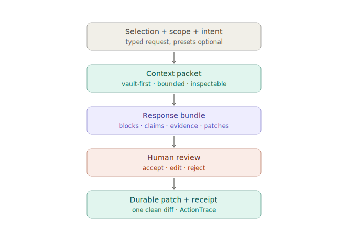
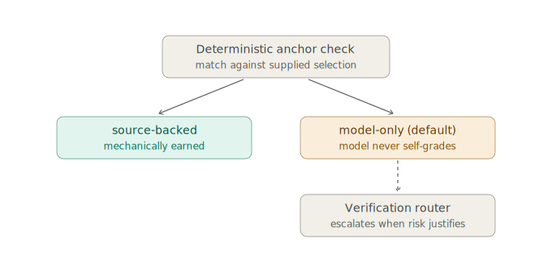

---
{
  "id": "06-ai-patch-pipeline",
  "title": "AI operation, context, and patch pipeline",
  "status": "foundational",
  "tags": [
    "ai",
    "patches",
    "operations",
    "context",
    "truth",
    "evidence",
    "verification",
    "providers",
    "execution-policy",
    "action-trace",
    "cost"
  ],
  "relations": [
    {
      "to": "05-resource-selection-model",
      "kind": "consumes"
    },
    {
      "to": "11-markdown-page-model",
      "kind": "writes"
    },
    {
      "to": "04-file-first-model",
      "kind": "patches"
    },
    {
      "to": "26-okf-agent-context",
      "kind": "uses"
    },
    {
      "to": "17-self-evolving-docs",
      "kind": "updates"
    },
    {
      "to": "19-dsl-future",
      "kind": "extends-to"
    },
    {
      "to": "28-truth-evidence-model",
      "kind": "extends-with-claim-evidence-contract"
    },
    {
      "to": "29-verification-grounding-router",
      "kind": "routes-through"
    },
    {
      "to": "31-truth-lens-ux",
      "kind": "rendered-by"
    },
    {
      "to": "33-retrieval-local-execution-cost",
      "kind": "emits-traces-defined-by"
    }
  ],
  "agent": {
    "purpose": "Keep AI behavior adaptive while making context assembly scoped, claims/evidence inspectable, verification cost-aware, outputs structured, patches reviewable, and files durable.",
    "inputs": [
      "selection list",
      "context scope",
      "typed user instruction",
      "optional preset or shortcut",
      "current note/context",
      "optional output hints and destinations",
      "verification policy",
      "privacy/cost budget",
      "provider capability snapshot",
      "execution policy",
      "operation budget"
    ],
    "outputs": [
      "adaptive response bundle",
      "Markdown/artifact blocks",
      "patch proposal",
      "new note proposal",
      "source dossier update",
      "index/log/context update",
      "future relation/scene proposal",
      "claim records",
      "evidence records",
      "verification events",
      "uncertainties",
      "provider/cost trace",
      "action trace",
      "operation receipt"
    ],
    "invariants": [
      "AI behaves as an adaptive companion, not a closed command menu.",
      "Input may be a free typed request, a preset, or both.",
      "Output may combine several block or artifact kinds when that best answers the user.",
      "AI proposes; user accepts or edits.",
      "Factual claims explicitly distinguish source-backed, model-only, needs-citation, and checked states.",
      "Interpretive, analogical, predictive, and normative content remains distinguishable when relevant.",
      "Patch preview is part of the UX.",
      "Cloud verification is bounded by privacy and cost policy.",
      "Important conversation results must be promoted into files, not hidden chat memory.",
      "Every real AI operation emits a minimal ActionTrace from the first implemented provider.",
      "Estimated, provider-reported, and billed usage remain distinguishable.",
      "Prompt and output content are not copied into telemetry by default."
    ]
  }
}
---

# AI operation, context, and patch pipeline

## Product stance



The AI should act as an adaptive learning companion, not as a fixed menu of commands.

It is useful to list common interaction types early because they help design the UI and tests. However, those lists are examples and shortcuts, not a closed taxonomy. The stable contract is the reviewable pipeline:

```text
selection + context scope + user intent
  -> scoped context assembly
  -> AI response bundle
  -> structured, inspectable blocks
  -> optional patch proposal
  -> user accepts / edits / rejects
```

Presets may exist for speed, but a typed request must remain a first-class input.

## Useful interaction intents, not fixed operation types

When the user selects text, image, code, math, or a source fragment, useful intents may include:

```text
explain simply
explain technically
turn into a note
extract key claims
produce math intuition and derivation
generate a code example
generate questions
summarize a section
compare with current note
append to current note
create linked note
update source dossier
update project brief
propose future relations
propose a future visual scene
```

This list should grow from real use. New interactions should not require redesigning the AI system.

## Input model

An AI operation can be launched from a typed request, a preset shortcut, or both:

```text
selection/context
  + context scope
  + typed instruction
  + optional preset
  + optional desired outputs
  + optional destination
```

Examples:

```text
Typed request only:
"Explain this like I know linear algebra but not transformers."

Preset plus typed request:
[preset: create study note]
"Include a small PyTorch-style code sketch and two questions."

Selection plus destination:
"Append this under the Current confusion heading."

Project-scoped request:
"Update the current brief with the source dossier / note distinction we just decided."
```

The preset is a convenience for prompt scaffolding and UI affordances. It is not the nature of the AI operation.

## Context assembly model

Atomik should not treat the project as a flat chunk database. The agent context engine should use the project hierarchy:

```text
resolve scope
  -> match selection terms against existing note titles/aliases/headings (vault-first)
  -> read nearest index.md
  -> read relevant log.md entries
  -> inspect frontmatter summaries
  -> follow relevant links/source references/backlinks
  -> retrieve within the chosen scope
  -> build a bounded context packet
```

The context packet should be visible or inspectable in the UI before it becomes a prompt when practical.

## Operation shape

```ts
type AiOperation = {
  id: string
  input: Selection[]

  // Where the agent may look before answering.
  scope?: ContextScope

  // Free text remains first-class.
  instruction: string

  // Optional shortcut chosen by UI or command palette.
  // This is open-ended, not a closed ontology.
  preset?: string

  // Hints guide the response but should not prevent useful extra blocks.
  desiredOutputs?: OutputHint[]

  // The operation may target one file, several files, or no file yet.
  target?: FileTarget | FileTarget[]

  context?: OperationContext

  // Controls local/web verification and claim checking.
  verificationPolicy?: VerificationPolicy

  // Controls deterministic/local/cloud execution and privacy.
  executionPolicy?: ExecutionPolicy

  // Hard limits are enforced below the renderer.
  budget?: OperationBudget
}

type ContextPacket = {
  id: string
  scope: ContextScope
  entries: ContextEntry[]
  budget: {
    maxTokens?: number
    policy: 'selection-first' | 'project-brief-first' | 'source-grounded' | string
  }
}

type ContextEntry = {
  path: string
  reason: string
  excerpt?: string
  frontmatter?: Record<string, unknown>
  anchors?: string[]
}

type OutputHint = {
  kind: string
  priority?: 'required' | 'preferred' | 'optional'
  metadata?: Record<string, unknown>
}

type AiResponseBundle = {
  id: string
  operationId: string
  blocks: AiOutputBlock[]
  patchProposals: PatchProposal[]
  provenance: Provenance[]

  // Truth-aware extension. Lightweight operations may leave these empty,
  // but unsupported factual claims must not be labeled as sourced.
  claims: ClaimRecord[]
  evidence: EvidenceRecord[]
  verification: VerificationEvent[]
  uncertainties: Array<{
    claimId?: string
    message: string
    severity?: 'info' | 'important' | 'blocking'
  }>
  // Cross-action traces replace provider-only accounting.
  actionTraceIds: string[]

  // Temporary compatibility field while integrations migrate.
  providerTrace?: ProviderTrace[]
}

type AiOutputBlock = {
  id: string

  // Open string so new block kinds can appear without schema churn.
  // Renderers may still provide special handling for known kinds.
  kind: string

  role?:
    | 'answer'
    | 'example'
    | 'math'
    | 'code'
    | 'question'
    | 'source-note'
    | 'relation-suggestion'
    | 'context-update'
    | string

  content: string
  metadata?: Record<string, unknown>
}

type PatchProposal = {
  id: string
  operationId: string
  files: ProposedFileChange[]
  provenance: Provenance[]
  claimChanges?: Array<{
    claimId: string
    action: 'add' | 'update' | 'supersede' | 'remove-link' | string
  }>
  verificationReportIds?: string[]
  status: 'pending' | 'accepted' | 'edited' | 'rejected'
}
```

Known block kinds can make the UI better. Unknown block kinds must still degrade to readable Markdown or plain text.

## Execution policy, budgets, and action traces

The model call is only one possible step. Retrieval, embedding, reranking, transcription, autocomplete, deterministic tools, web verification, and patch application can all consume time, money, energy, privacy, or human attention.

```ts
type ExecutionPolicy = {
  preferred: 'deterministic' | 'local-model' | 'cloud-model' | 'web' | 'auto'
  allowed: Array<'deterministic' | 'local-model' | 'cloud-model' | 'web'>
  privacyMode: 'offline' | 'private' | 'balanced' | 'cloud'
  requireApprovalBeforeExternal?: boolean
}

type OperationBudget = {
  maxInputTokens?: number
  maxOutputTokens?: number
  maxContextTokens?: number
  maxWebQueries?: number
  maxWallMs?: number
  maxExternalCost?: { currency: string; amount: number }
}

type ActionTrace = {
  id: string
  parentId?: string
  operationId?: string
  action: string
  execution: {
    location: 'deterministic' | 'local-model' | 'cloud-model' | 'web'
    provider?: string
    model?: string
    modelVersion?: string
    deviceProfile?: string
  }
  usage?: {
    estimatedInputTokens?: number
    inputTokens?: number
    outputTokens?: number
    cachedInputTokens?: number
    reasoningTokens?: number
    webQueries?: number
    retries?: number
    audioSeconds?: number
  }
  performance: {
    wallMs: number
    firstResultMs?: number
    cpuMs?: number
    gpuMs?: number
    peakRamBytes?: number
    estimatedEnergyWh?: number
  }
  billing?: {
    currency: string
    estimatedAmount?: number
    reportedAmount?: number
    basis: 'estimated' | 'provider-reported' | 'billed'
    priceSnapshotId?: string
  }
  outcome: {
    status: 'completed' | 'cancelled' | 'failed'
    accepted?: boolean
    acceptedCharacters?: number
    patchAccepted?: boolean
  }
  privacy: {
    mode: 'offline' | 'private' | 'balanced' | 'cloud'
    externalBytes?: number
    contentRecorded: boolean
  }
}
```

The complete machine contract lives in `operation_trace_contract_v0_1.json`. Counts reported by a provider or runtime should be preferred over estimates. Estimates remain useful for preflight budgets but must be labeled as estimates. For local work, `external cost = 0` does not erase CPU/GPU time, memory, battery, latency, or model-maintenance cost.

Content recording is opt-in. The default trace stores identifiers, counts, hashes, paths or path IDs, and outcomes—not raw prompts, note text, transcripts, or model output.

## Output model: response bundle

A proper answer may need several output blocks at once. For example, a single response may contain:

```text
short explanation
+ technical explanation
+ equation block
+ code sketch
+ questions
+ proposed Markdown patch
+ source dossier update
+ possible future relation suggestions
```

The system should model AI output as a bundle of blocks and optional patch proposals, not as exactly one `outputKind`.

### Existing-note referencing

When a response mentions a term that matches an existing vault note, the bundle should carry a `relation-suggestion` block proposing the link — the reserved role becomes the response-side carrier of the reuse loop. Accepted suggestions become ordinary wikilinks through the normal patch flow; the model never inserts links to notes it did not verify exist.

## Durable patch destinations

AI patches may target:

```text
current note
new note
source.md dossier
extracted.md / transcript.md / quotes/*.md
project/index.md
project/log.md
context/current-brief.md
questions.md
ADR or module learning note
git-friendly manifest update
```

Patching `log.md` and `index.md` is how a long-running project stays navigable for future agents without depending on one chat history.

## UX rule

The AI panel should show the response bundle clearly and offer explicit destinations:

```text
insert here
append under heading
create new note
update source dossier
update current brief
append to log
open in new tab
copy
inspect operation receipt
discard
```

A single response can offer multiple destinations: one block might be copied, another inserted, and a patch proposal accepted into a note.

## Safety rule

AI must not write directly to files without user-visible review, except for explicitly enabled autosave workflows that still leave a patch record. External execution, hard budgets, cancellation, and local-only policy must be enforced below the renderer rather than trusted to UI state.

## Git rule

One accepted AI operation should produce one understandable diff. The app must avoid rewriting frontmatter, timestamps, or formatting across unrelated files.

## Implementation warning

Avoid hard-coding the early interaction examples as a permanent TypeScript union such as `outputKind = 'explanation' | 'summary' | ...`.

Prefer open presets, output hints, response blocks, validators, context packets, and graceful fallbacks. Atomik should reserve structure without freezing learning.

## Truth-aware generation and verification

The operation pipeline now has two separable stages:

```text
generation/synthesis
  produces useful prose, claim candidates, source mappings, uncertainty, and patch proposals

verification
  applies local checks, deterministic tools, public knowledge, or live web checks according to policy
```

A response does not have to verify every sentence. It must avoid laundering unsupported factual claims into a source-backed state.

```text
source supplied and anchor matches
  -> source-linked / locally verified

model introduces an uncited factual detail
  -> model-only / needs citation

model uses an analogy
  -> analogical, with limits if material

model offers a moral judgment
  -> normative, with frame/rationale

current or disputed claim
  -> verification router decides whether to search
```

### Mechanical labeling rule (MVP)



`source-backed` is assigned mechanically, never by model self-report: only when the content is deterministically derivable from the supplied selection/anchor (anchor match, quote hash). All other factual content defaults to `model-only`. A model grading its own groundedness is confidence theater with better vocabulary — the same trap as treating model agreement as independent verification. `interpretive`, `analogical`, and `needs-citation` may be model-asserted, but they describe form, not evidence, and are rendered from explicit block metadata only.

Provider-grounded output remains a distinct provider response object until rendered to the prompting user. A durable note should cite an imported destination source or other reusable evidence rather than mining provider-grounded results into the vault.

## Minimal MVP truth contract

```text
labels:
  source-backed
  model-only
  needs citation
  checked with web
  interpretive

actions:
  open source anchor
  verify claim
  challenge claim
  propose repair patch
```

The full claim graph is not required for the first AI-over-selection loop.


## Minimal MVP execution contract

From the first mocked AI operation, record at least:

```text
operation/action id
execution location
provider/model or deterministic tool identity
estimated and actual input/output tokens when available
wall-clock latency
external estimated/reported cost
completed/cancelled/failed
accepted/edited/rejected outcome
contentRecorded = false by default
```

The provider/cost dashboard is later. The trace is not.
