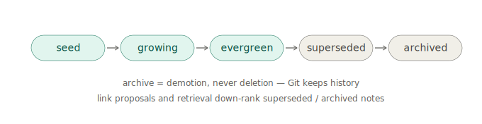

---
{
  "id": "11-markdown-page-model",
  "title": "Markdown note and concept model",
  "status": "foundational",
  "tags": [
    "markdown",
    "notes",
    "atomic",
    "okf",
    "truth",
    "claims",
    "dictionary"
  ],
  "relations": [
    {
      "to": "04-file-first-model",
      "kind": "implements"
    },
    {
      "to": "06-ai-patch-pipeline",
      "kind": "target"
    },
    {
      "to": "07-source-adapters",
      "kind": "references"
    },
    {
      "to": "20-relations-future",
      "kind": "prepares"
    },
    {
      "to": "19-dsl-future",
      "kind": "hosts"
    },
    {
      "to": "28-truth-evidence-model",
      "kind": "hosts-evidence-aware-notes"
    },
    {
      "to": "30-public-knowledge-dictionary",
      "kind": "extends-to-dictionary-entry"
    },
    {
      "to": "31-truth-lens-ux",
      "kind": "rendered-with"
    }
  ],
  "agent": {
    "purpose": "Keep notes readable, adaptive, OKF-compatible where useful, and useful before graph/DSL/canvas systems exist.",
    "inputs": [
      "AI response bundle",
      "source reference",
      "user edit",
      "subject-specific structure",
      "frontmatter"
    ],
    "outputs": [
      "Markdown file",
      "optional frontmatter",
      "optional provenance section",
      "future relation/scene slots"
    ],
    "invariants": [
      "Plain Markdown is the first durable output.",
      "Generated notes should be editable by humans.",
      "Do not force one universal note template.",
      "Note structure should adapt to the subject, source, and user intent.",
      "Reserve future sections without requiring them.",
      "Unknown frontmatter fields must be preserved when possible.",
      "Human-readable Markdown exposes material citation, dispute, freshness, and interpretation status; exact sidecars remain optional support."
    ]
  }
}
---

# Markdown note and concept model

## Purpose

Markdown is the first durable knowledge medium in Atomik.

The goal is not to define one perfect note schema. The goal is to make AI outputs and user notes readable, editable, source-grounded when needed, OKF-compatible where useful, and useful outside the app.

```text
Markdown is the durable medium.
The note shape is adaptive.
Atomik may suggest structure, but must not force one universal template.
```

## Required invariants

A durable note should preserve these qualities:

```text
readable as plain Markdown
meaningful title or first heading
human-editable body
source/provenance when source-grounded
no required universal section set
future syntax remains optional
Git diff remains understandable
```

Frontmatter is useful, but not every early note needs the same metadata.

## OKF-compatible frontmatter profile

Atomik should prefer frontmatter that can be consumed by OKF-style tools while allowing Atomik-specific extensions.

```md
---
type: Atomik Note
title: Query, key, and value vectors define attention lookup
description: Attention compares query vectors with key vectors to weight value vectors.
tags: [ai, transformers, attention]
timestamp: 2026-06-17T00:00:00Z
atomik:
  id: note_attention_qkv
  status: seed
sources:
  - source: ../sources/pdf/attention-is-all-you-need/source.md
    anchor: p3-attention-formula
---
```

`type` keeps the file recognizable as a concept. `atomik` and `sources` are producer-defined extensions that Atomik should preserve.

## Example note scaffold, not a required template

This scaffold is one possible shape for a concept note:

```md
# Title as a proposition

## Core idea

## Explanation

## Math

## Code

## Examples

## Links

## Questions
```

The AI may omit, rename, split, or reorder sections depending on the subject.

## Subject-driven note shapes

Different subjects may need different structures:

```text
math note
  intuition -> definition -> derivation -> worked example -> questions

code note
  problem -> minimal snippet -> explanation -> edge cases -> tests

book/source note
  excerpt -> claim -> interpretation -> source anchor -> follow-up

art note
  visual observation -> historical context -> style comparison -> image/source link

project architecture note
  decision -> consequences -> alternatives -> open risks -> links
```

These are examples. The user and subject decide the final shape.

## Source-grounded note example

This is one coherent source-grounded note, not the canonical form of all notes:

````md
---
type: Atomik Note
title: Query, key, and value vectors define attention lookup
description: Attention compares a query vector with key vectors to decide how strongly to combine value vectors.
tags: [ai, attention]
timestamp: 2026-06-17T00:00:00Z
atomik:
  status: seed
sources:
  - source: ../sources/captures/2026-06-14-handwritten-attention/source.md
    anchor: original-image
---

# Query, key, and value vectors define attention lookup

## Core idea

Attention compares a query vector with key vectors to decide how strongly to combine value vectors.

## Math

$$
Attention(Q,K,V)=softmax(QK^T/\sqrt{d_k})V
$$

## Code sketch

```python
scores = q @ k.T / math.sqrt(d_k)
weights = softmax(scores)
output = weights @ v
```

## Questions

- Why divide by sqrt(d_k)?
- How does multi-head attention change this?
````

## Markdown as future host

Markdown can later host:

```text
wikilinks
source references
relation claim blocks
Atomik DSL fenced blocks
callouts
status metadata
review notes
```

But those should remain optional. A plain Markdown reader should still make sense of the file.

## Git rule

Atomik should preserve user formatting when possible, avoid rewriting frontmatter ordering unnecessarily, and avoid updating timestamps unless content meaningfully changed.

## Truth-aware note profile

The goal is not to formalize every sentence. Atomik supports a spectrum.

### Lightweight note

```md
# My current understanding

Attention can be understood as a content-addressed lookup. This is an analogy, not a literal implementation description.
```

### Evidence-aware note

```md
---
type: Atomik Note
title: Example sourced note
atomik:
  id: note_example
  truth:
    profile: evidence-aware
    last_checked: 2026-06-22
sources:
  - source: ../sources/pdf/example/source.md
    anchor: p3-key-claim
---

# Example sourced note

The paper states the mechanism on page 3. [source]

> Truth status: factual · primary-source-backed · locally verified
```

### Promoted claim

A disputed, high-impact, heavily reused, or stale-sensitive claim may receive a stable claim note or explicit claim section with evidence and verification history.

`human-accepted` belongs to workflow metadata. It must not be rendered as “factually verified.”

## Note lifecycle



Claims have a lifecycle; notes previously stopped at `seed`. The note profile now supports:

```text
atomik.status: seed | growing | evergreen | superseded | archived | <open string>
```

Rules:

```text
lifecycle is editorial state, not truth state
archive is demotion, never deletion — Git already preserves history;
  archived notes may move to archive/ or carry status only
superseded notes link forward to their replacement
retrieval and link proposals down-rank archived/superseded notes by default
a vault that only accumulates will eventually resurface its own early mistakes
  with the authority of "paid-for knowledge"; decomposition is part of the ecology
```

The reuse loop makes this urgent rather than theoretical: a system that proposes existing notes on hover will faithfully propose stale ones unless lifecycle informs ranking.

## Dictionary page profile

Dictionary entries remain Markdown pages with structured frontmatter or adjacent records for lemma, language, forms, senses, pronunciation, usage, sources, and etymology paths. Reconstructed or disputed etymology is visible in the readable page, not only in a sidecar.
