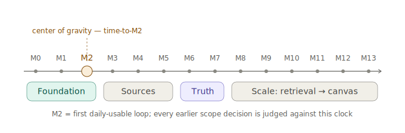

---
{
  "id": "18-roadmap",
  "title": "MVP roadmap: daily-use first, truth-aware from the AI loop",
  "status": "planning",
  "eyebrow": "Implementation sequence",
  "summary": "The workbench remains first; minimal truth and operation-cost traces arrive with the first AI loop, followed by local capture/transcription, hybrid retrieval, measured local assistance, public knowledge, and later DSL/canvas.",
  "tags": [
    "roadmap",
    "mvp",
    "sequence",
    "project-bundle",
    "git",
    "truth",
    "verification",
    "knowledge-packs",
    "retrieval",
    "local-models",
    "speech-to-text",
    "autocomplete",
    "cost-observability"
  ],
  "relations": [
    {
      "to": "01-workbench-first",
      "kind": "implements"
    },
    {
      "to": "12-electron-mvp",
      "kind": "starts"
    },
    {
      "to": "08-capture-source",
      "kind": "prioritizes"
    },
    {
      "to": "26-okf-agent-context",
      "kind": "adds-scoped-retrieval"
    },
    {
      "to": "27-git-compatibility",
      "kind": "continuous-constraint"
    },
    {
      "to": "28-truth-evidence-model",
      "kind": "introduces-minimal-contract-early"
    },
    {
      "to": "29-verification-grounding-router",
      "kind": "adds-after-local-evidence"
    },
    {
      "to": "30-public-knowledge-dictionary",
      "kind": "adds-after-core-source-loop"
    },
    {
      "to": "31-truth-lens-ux",
      "kind": "grows-progressively"
    },
    {
      "to": "19-dsl-future",
      "kind": "defers"
    },
    {
      "to": "33-retrieval-local-execution-cost",
      "kind": "phases"
    },
    {
      "to": "34-local-execution-investigation-record",
      "kind": "uses-dated-capability-evidence-from"
    }
  ],
  "agent": {
    "purpose": "Sequence features so Atomik becomes useful quickly while preserving truth, retrieval, local/cloud execution, operation-cost visibility, source dossiers, provider boundaries, Git compatibility, and later DSL/canvas architecture.",
    "inputs": [
      "current milestone",
      "feature idea",
      "user need",
      "truth risk",
      "provider dependency",
      "cost/privacy impact",
      "device capability",
      "retrieval evaluation",
      "local/cloud execution tradeoff"
    ],
    "outputs": [
      "phase assignment",
      "acceptance test",
      "defer decision",
      "truth/verification requirement",
      "execution observability requirement",
      "local capability evaluation gate"
    ],
    "invariants": [
      "Daily usability comes first.",
      "Minimal evidence status arrives with the AI loop; a complete epistemic graph does not.",
      "Implement extension points, not empty future packages.",
      "Phone capture can arrive before PDF/web because it is high-value and bounded.",
      "Local source evidence precedes live web grounding.",
      "Provider keys, terms, privacy, and budgets are first-class integration constraints.",
      "Source dossiers are Markdown-first from the beginning.",
      "Git-friendly writes are a continuous constraint.",
      "DSL/canvas arrive after the workbench and trust loops work.",
      "A minimal ActionTrace arrives with the first real or mocked AI operation.",
      "No vector database is required for the first useful retrieval implementation.",
      "Local transcription and autocomplete are capability-tested adapters, not universal promises.",
      "Local execution is externally unbilled but still measured for latency and resource use."
    ]
  }
}
---

# MVP roadmap: daily-use first, truth- and cost-aware from the AI loop

## Roadmap thesis

Truth architecture and execution economics should shape the early contracts without delaying the useful workbench.

Wrong sequence:

```text
design complete global claim graph
install a vector database before search works
run a large model on every keystroke
build full web research automation
then finally edit a note
```

Correct sequence:

```text
useful local workbench
  -> AI patch loop with minimal evidence status + ActionTrace
  -> real sources, anchors, and local transcription
  -> one challenge/repair path
  -> bounded live verification
  -> lexical/link/structural retrieval and inspectable context packets
  -> optional local semantic retrieval and autocomplete after evaluation
  -> richer Truth Lens and local public knowledge
  -> later graph, DSL, and canvas
```

### Center of gravity



Time-to-M2 is currently the only meaningful metric. Everything downstream — the dogfooding flywheel, friction-driven prioritization, the trace history M11 aggregates, validation of the Truth Lens's calm/honesty balance — unblocks only when M2 exists in daily hands. Every scope decision before M2 is judged against this clock.

## Milestone 0: Electron shell

```text
Electron + Vite + React + TypeScript
secure main/preload/renderer split
app window
tabs and split panes
settings storage
Dev Docs tab reading local docs
narrow typed IPC
provider keys never exposed to renderer
trusted worker/sidecar boundary reserved for local runtimes
```

Acceptance:

```text
app starts
Dev Docs opens the current bedrock bundle
remote content has no Node access
preload exposes only documented typed methods
local/cloud policy can be enforced below renderer state
```

## Milestone 1: Local Markdown vault + project bundle

```text
open vault folder
create/open project folder
project index.md and log.md conventions
file tree
create/read/write Markdown
CodeMirror editor
Markdown preview
explicit save or safe autosave
filename/heading search basics
Git-friendly write discipline
source dossier folder conventions
```

Acceptance:

```text
knowledge survives app restart
workspace state can be deleted without losing content
opening the app does not rewrite files
one edit creates one understandable diff
```

## Milestone 2: AI over notes + minimal truth and execution contracts

```text
select text in note
create Selection + ContextScope
ask AI through a provider-neutral interface
receive structured response bundle
render blocks, patch preview, and operation receipt
insert inline / append / create note
```

Minimal truth slice:

```text
response can label:
  source-backed
  model-only
  needs citation
  interpretive
```

Minimal execution slice:

```text
ActionTrace records:
  action/operation id
  deterministic/local/cloud/web location
  provider/model/tool identity and version when known
  estimated and actual input/output tokens when available
  wall-clock latency
  external estimated/reported cost
  completed/cancelled/failed
  accepted/edited/rejected outcome
  contentRecorded = false by default
```

No live web grounding is required yet. Start with mocks and local selected evidence, but use the final trace shape from the beginning.

Guardrails:

```text
thinness rule: M2 effort stays in the same order of magnitude as M1;
  if M2 takes much longer than M1, ceremony has won — cut back to the contracts above
the minimal trace is one appended JSON line plus a badge; nothing more
source-backed is mechanical (anchor match / quote hash); the model never self-grades;
  everything else defaults to model-only
```

Acceptance:

```text
selected local passage can become a source-linked note
uncited factual detail is marked needs citation/model-only
interpretation can be labeled without blocking prose
accepted patch produces one meaningful diff
local/cloud/tool path and basic usage are inspectable
hard operation budget and cancellation are enforced below renderer
source-backed label is reproducible by a deterministic check, not model output
```

Experiential gate (closes M1+M2 together): the creator uses Atomik as the primary learning-notes tool for two consecutive weeks, recording every friction point as project files inside Atomik. Functional tests alone do not close these milestones.

## Milestone 3: Capture sources + local speech baseline

```text
QR local upload for phone images and short audio
save original image/audio
create source.md dossier
image source tab
replaceable OCR/transcription adapter
create transcript.md and optional timestamp sidecar
human correction flow
```

Truth and execution slice:

```text
original media remains evidence
OCR/transcript is visibly derived
model cleanup is not confused with verbatim transcription
execution location, runtime/model/version, latency, and external cost are recorded
```

Desktop local transcription is the first target. Mobile on-device transcription is an evaluated capability tier, not a release-wide guarantee.

## Milestone 4: PDF source tab + strong anchors

```text
open PDF
page viewer
create source.md dossier
extract text
page/text/region anchors
selection -> AI -> note
return from citation to original page
```

Truth slice:

```text
renderer fidelity and extraction fidelity are separate
page anchor survives note creation
citation-support check can compare claim with quote/page
extraction emits an ActionTrace
```

## Milestone 5: Web source tab and explicit imports

```text
isolated WebContentsView
reader extraction
snapshot/source.md dossier
URL + access date + revision metadata
selection -> AI -> note
trail creation later
```

Truth/provider boundary:

```text
web source import = durable source ingestion
provider grounding = separate transient verification path
no automatic crawl/index from grounding links
```

## Milestone 6: Minimal Truth Lens + challenge/repair

```text
answer-level claim/evidence summary
select claim -> open evidence drawer
open mapped source anchor
challenge reason menu
local verification plan
repair patch preview
accept/edit/reject
compact operation receipt beside the result
```

Acceptance:

```text
user can challenge one factual claim end to end
unsupported citation can be removed or replaced
scope can be narrowed through a patch
contradiction can remain unresolved instead of being hidden
```

## Milestone 7: Live verification provider

First provider implementation may use Gemini API with Grounding with Google Search, behind a provider-neutral contract.

Implementation:

```text
risk/freshness router
local evidence first
user-configurable verification modes
hard query, token, time, and cost budgets
private/local-only mode
provider result component with required links/suggestions
actual query-count and usage trace
terms/pricing capability snapshot
explicit destination-source import
```

Acceptance:

```text
stable rewrite triggers no search
current Tier 2 claim triggers bounded search
one prompt with several provider queries records several queries
private context is minimized
provider-grounded output is not ingested as a database
selected destination page can be imported through source-core
```

## Milestone 8: Hybrid retrieval + agent context basics

```text
wikilinks and backlinks
source references searchable
index.md/log.md helpers
project context/current-brief.md
explicit selection and open-resource scope
filename/path/heading/frontmatter/link retrieval
ripgrep or SQLite FTS5/BM25 full-text retrieval
Tree-sitter/LSP structural retrieval for code when available
inspectable context packet and omitted-entry diagnostics
small retrieval evaluation set
note-title/alias/heading link index feeding passive link proposals
simple Git status/diff view optional
```

Truth and cost slice:

```text
retrieval relevance is not treated as truth
supporting and contradicting evidence can coexist
retrieval stages, candidates, selected entries, context tokens, and latency are traced
no vector database or embedding service is required
```

## Milestone 9: Measured local assistance and autocomplete

```text
deterministic completion for Markdown syntax, links, headings, tags, and project paths
optional local embedding experiment after lexical baseline exists
optional local reranker for ambiguous large result sets
explicit or debounced local text completion using nearby context
edit prediction experiment on desktop after editor stability
mobile starts with deterministic completion, capture, and speech input
passive link proposal on hover/selection: deterministic title/alias/heading match first;
  semantic matching only behind the standard evaluation gate
```

Guardrails:

```text
no vault-wide semantic search on every keystroke
no large model required to type ordinary Markdown
all predictions cancellable and aggressively budgeted
acceptance rate, accepted characters, latency, memory, and battery/energy proxy measured
cloud completion remains explicit and policy-controlled
```

Model candidates belong in dated research records. They are not architectural dependencies.

## Milestone 10: Public knowledge and dictionary MVP

```text
manual Wikipedia/Wiktionary import as source dossier
revision/snapshot/access metadata
basic dictionary Markdown page
Wikidata item/Lexeme lookup
etymology status: attested / reconstructed / disputed / unknown
attribution export
```

Then:

```text
selected article/entry packs
local full-text index
knowledge-pack manifest
specialist dictionary/source-pack support
```

Do not start by downloading every language edition.

## Milestone 11: Truth maintenance + execution economics dashboard

```text
claim segmentation assistance
contradiction inbox
stale-claim queue
source-independence groups
provider and local usage dashboard
cost per accepted patch/result
context tokens per opened citation
web queries per successfully verified claim
transcription compute/correction cost
claim-level history
```

The dashboard grows from traces emitted since M2. It is not a reason to defer instrumentation until M11.

## Milestone 12: Atomik DSL

```text
line-oriented DSL parser
scene renderer
AI generates scene from note/source
validator + repair loop
scene files remain Git-friendly
scene claims link to evidence/Truth Lens
visual analogy and assumptions are labeled
```

## Milestone 13: Canvas

```text
notes + sources + scenes as nodes
typed edges
side page opening
AI-generated learning map
canvas references files rather than owning knowledge
claim/evidence status inspectable on nodes/edges
spatial emphasis never changes truth state
```

## Continuous constraints

```text
no hidden database-only notes
no source knowledge trapped only in JSON
no cache/index/embedding as canonical memory
no mandatory vector database for baseline search
no embedding or reranking call without a measured need
no large-model request on every keystroke by default
no AI file write without patch preview
no remote content with Node integration
no provider key in renderer or remote view
no automatic knowledge database from provider-grounding output
no universal confidence score presented as truth
no unsupported claim labeled source-backed
no human acceptance presented as factual proof
no raw prompt/output telemetry by default
no local “€0” label that hides latency/resource use
no noisy Git rewrites on read/open/render
no bulk auto-linking rewrites; link proposals are accepted individually
```

## Deferred without forgetting

```text
complete global claim graph
continuous background web crawling
full multilingual Wikimedia mirror
team reputation system
formal source-quality scoring ontology
advanced etymology visualization
claim-level collaborative review roles
fully autonomous model routing without visible policy
spaced review / retention queue (rebuildable projection over notes, questions, trails)
```

Each remains possible because the early contracts preserve claims, evidence, anchors, execution traces, provider boundaries, context packets, and patches.
