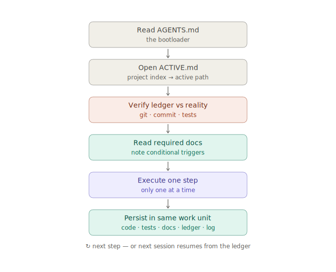

---
{
  "id": "22-agent-handoff",
  "title": "Coding agent bootstrap protocol",
  "status": "ready-to-use",
  "tags": [
    "agent",
    "handoff",
    "bootstrap",
    "coding-path",
    "work-ledger",
    "implementation",
    "okf",
    "git",
    "truth",
    "execution-cost"
  ],
  "relations": [
    { "to": "35-coding-path-execution-state", "kind": "implements" },
    { "to": "26-okf-agent-context", "kind": "uses" },
    { "to": "18-roadmap", "kind": "executes-through-paths" },
    { "to": "13-electron-security", "kind": "must-obey" },
    { "to": "17-self-evolving-docs", "kind": "must-update" },
    { "to": "14-app-kernels", "kind": "implements" },
    { "to": "27-git-compatibility", "kind": "must-preserve" },
    { "to": "28-truth-evidence-model", "kind": "must-implement-minimal-contract" },
    { "to": "33-retrieval-local-execution-cost", "kind": "must-obey" }
  ],
  "agent": {
    "purpose": "Define how any coding agent enters, executes, and leaves work on Atomik so that all execution state survives in files rather than conversation threads.",
    "inputs": [
      "AGENTS.md",
      "atomik-project/index.md",
      "active coding path",
      "work ledger checkpoint",
      "repository and test state"
    ],
    "outputs": [
      "executed path steps",
      "updated work ledger",
      "code + tests + docs in one work unit",
      "log.md entries",
      "generated brief on handoff only"
    ],
    "invariants": [
      "Navigate Bedrock for knowledge; follow a Coding Path for execution; persist progress in the Work Ledger; generate a brief only as a portable view of that state.",
      "Never begin implementation without an active coding path; propose one first if none exists.",
      "Never silently invent architecture outside the bedrock.",
      "Read every Required document of the active path; honor Conditional triggers; respect Deliberately excluded entries.",
      "Verify repository reality against the ledger before executing; reconcile mismatches explicitly.",
      "Every executed step updates code, tests, documentation, the ledger, and log.md in the same work unit.",
      "Do not hide canonical knowledge or execution state in caches, embeddings, or chat memory.",
      "Provider keys and private context stay behind typed secure boundaries.",
      "Emit a minimal ActionTrace from the first AI mock; no raw prompt/output telemetry by default."
    ]
  }
}
---

# Coding agent bootstrap protocol

## Role of this document

This page is the re-entry procedure for any implementation session — human, coding agent, or both. It replaced the earlier static first-milestone recipe: that content now lives as the first concrete coding path, `atomik-project/coding-paths/CP-MVP-001.md`, where its progress can actually be tracked.

```text
Bedrock docs   = what the architecture should be
code + tests   = what currently exists
Coding Path    = what this task will change, in what order, and where it stands
```

## The protocol



```text
1. Read AGENTS.md.
2. Read atomik-project/index.md.
3. Open atomik-project/coding-paths/ACTIVE.md and follow it to the active path.
4. Verify reality against the Work Ledger:
   git status, base commit, dirty files, test state.
   If they disagree, reconcile and record the correction before anything else.
5. Read the documents listed under Required in the path's documentation coverage.
6. Note the Conditional triggers; read those documents when a trigger fires.
7. Confirm the Deliberately excluded list; do not silently widen scope.
8. Execute ONE path step at a time.
9. After each step, in the same work unit:
   update tests, update the Work Ledger checkpoint,
   update module notes / affected docs, append to log.md.
10. Generate a brief into atomik-project/briefs/ ONLY when handing work
    to another session, agent, or person.
```

## If no active path exists

Do not start coding. Propose a new coding path from the relevant roadmap milestone using the template in `24_24-doc-templates.md`, including its documentation coverage and definition of done. The path is reviewed and accepted like any other patch; then execution begins at step 1.

## Standing prohibitions

These apply across all paths and are restated inside `CP-MVP-001.md` where milestone-specific:

```text
no work outside an accepted coding path
no undocumented core module
no hidden database-only notes or JSON-only canonical source records
no remote content with Node integration; no generic IPC bridge
no provider keys in renderer or remote views
no mandatory vector database before lexical retrieval is evaluated
no raw prompt/output telemetry by default
no unsupported claim labeled source-backed
no automatic crawl/index from provider-grounding links
no mass file rewrites on app open
```

## Completion report

When reporting a step or path as done, follow the final response requirement of `agent_documentation_contract.md`, which now includes the updated coding path step and Work Ledger state.
