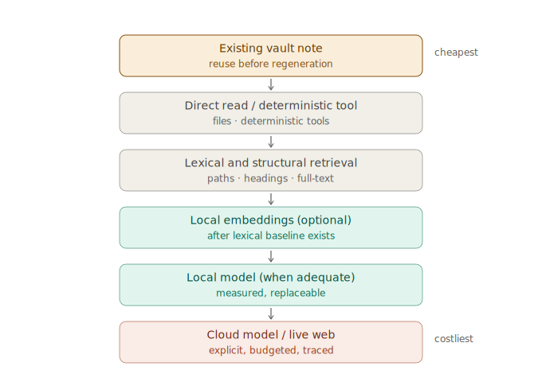

---
{
  "id": "33-retrieval-local-execution-cost",
  "title": "Retrieval, local inference, and operation cost",
  "status": "foundational",
  "eyebrow": "Execution economics",
  "summary": "Atomik treats retrieval as a strategy-pluggable context-compilation system, uses local models where measured capability justifies them, and emits privacy-aware operation receipts across search, transcription, autocomplete, generation, verification, and patches.",
  "tags": [
    "retrieval",
    "rag",
    "context-compilation",
    "embeddings",
    "local-models",
    "speech-to-text",
    "autocomplete",
    "cost",
    "telemetry",
    "privacy",
    "mobile"
  ],
  "relations": [
    {
      "to": "00-orientation",
      "kind": "extends"
    },
    {
      "to": "06-ai-patch-pipeline",
      "kind": "defines-execution-contract-for"
    },
    {
      "to": "07-source-adapters",
      "kind": "defines-local-transcription-policy-for"
    },
    {
      "to": "12-electron-mvp",
      "kind": "defines-runtime-boundary-for"
    },
    {
      "to": "14-app-kernels",
      "kind": "adds-execution-boundary-to"
    },
    {
      "to": "18-roadmap",
      "kind": "phased-by"
    },
    {
      "to": "26-okf-agent-context",
      "kind": "defines-retrieval-ladder-for"
    },
    {
      "to": "29-verification-grounding-router",
      "kind": "generalizes-cost-trace-beyond"
    },
    {
      "to": "31-truth-lens-ux",
      "kind": "surfaced-by"
    },
    {
      "to": "34-local-execution-investigation-record",
      "kind": "supported-by"
    }
  ],
  "agent": {
    "purpose": "Choose the cheapest sufficient retrieval and execution path while preserving inspectability, privacy, user control, future replaceability, and measurable outcome quality.",
    "inputs": [
      "user intent",
      "selection and scope",
      "project structure",
      "device capability",
      "privacy mode",
      "operation budget",
      "retrieval evaluation",
      "model/runtime capability snapshot"
    ],
    "outputs": [
      "retrieval plan",
      "ContextPacket",
      "ExecutionPolicy",
      "OperationBudget",
      "ActionTrace",
      "operation receipt",
      "local/cloud fallback decision",
      "evaluation report"
    ],
    "invariants": [
      "RAG describes generation informed by retrieved context; it is not synonymous with embeddings or a vector database.",
      "Use explicit scope, lexical/link/structural retrieval, and deterministic tools before more expensive semantic or generative stages by default.",
      "Embeddings, rerankers, indexes, and model caches are rebuildable derived state.",
      "Local and cloud execution are replaceable policy choices, not properties of canonical knowledge.",
      "Every meaningful action can expose location, work units, latency, privacy, external billing, and outcome.",
      "Local execution is not economically free merely because external billing is zero.",
      "Raw prompts, notes, transcripts, and outputs are not recorded in telemetry by default.",
      "Model candidates and performance claims remain dated research inputs until evaluated on Atomik workloads and devices."
    ]
  }
}
---

# Retrieval, local inference, and operation cost

## Position

Atomik should not equate retrieval-augmented generation with an embedding API and a vector database.

```text
search
  query -> candidate resources

context compilation
  candidates -> bounded, inspectable ContextPacket

generation or direct action
  ContextPacket -> answer, transcript, completion, verification, or patch
```

A coding agent using `grep`, filenames, symbols, an AST, or LSP is already retrieving context before acting. Embeddings are one retriever among several.

There is no universal state-of-the-art retriever for every Atomik workload. The best practical system is usually hybrid, scoped, measured, and content-specific.

## Retrieval ladder



Use the cheapest sufficient stage:

```text
0. explicit selection, open resources, pinned paths, and direct reads —
   including the user's own existing notes matched by title/alias/heading (vault-first)
1. paths, filenames, headings, frontmatter, Markdown links, exact grep, FTS5/BM25
2. structural retrieval: Markdown AST, Tree-sitter, LSP symbols/definitions/references
3. optional local semantic embeddings for conceptual, paraphrase, or cross-language search
4. optional local reranker for ambiguous or large candidate sets
5. bounded external retrieval for freshness, missing knowledge, or verification
6. context compiler selects the smallest sufficient inspectable packet
```

The planner may skip stages when the request is explicit. A selected paragraph should not trigger a vault-wide semantic search. A current legal or software claim may need external verification even when the local search is excellent.

Typical defaults:

| Material | First choice |
|---|---|
| current selection or active note | direct read |
| Markdown project | headings, frontmatter, links, FTS5/BM25 |
| source code | path/grep + Tree-sitter/LSP |
| conceptual natural-language query | lexical hybrid, then optional embeddings |
| cross-language query | optional multilingual embeddings after evaluation |
| current factual claim | local evidence, then verification router |

Retrieval score remains relevance evidence, not truth status.

## First retrieval implementation

The first useful Atomik does not require a vector database.

```text
ripgrep or equivalent exact search
SQLite FTS5/BM25 index
frontmatter, heading, link, and source-anchor index
Tree-sitter/LSP adapters for code when present
inspectable ContextPacket
retrieval trace and evaluation fixtures
```

Embeddings may be added after a representative evaluation shows relevant material missed by the lexical/link/structural baseline.

## Local embeddings policy

Local embedding models are now credible implementation candidates for desktop and some mobile devices. That makes paid embedding APIs optional rather than architecturally required.

The policy is:

```text
model and runtime are replaceable
model revision and quantization are recorded
vector dimensions are configurable
indexes are rebuildable and deletable
no semantic call is required for direct or exact queries
benchmark gains must justify index time, storage, latency, memory, and energy
```

Device tiers may choose different models or disable semantic retrieval entirely. Candidate names belong in the dated investigation record, not in the foundational contract.

## Local speech-to-text

Speech capture is a source-adapter problem, not a chat-only feature.

```text
original audio/video
  -> local capability probe
  -> local transcription when adequate
  -> optional explicit cloud fallback
  -> transcript.md
  -> optional timestamp/speaker sidecar
  -> human correction
  -> notes linked to time anchors
```

Desktop/laptop local transcription should be implemented first. Mobile on-device transcription is technically possible but must be gated by model size, runtime support, memory, thermals, battery, language quality, and real-time requirements.

Evaluate on the user's real recordings:

```text
language and accent
quiet and noisy audio
phone and laptop microphones
technical vocabulary
word and segment timestamps
real-time factor
peak memory
battery/energy proxy
correction effort
```

The winning model minimizes cost per usable corrected transcript, not merely a public benchmark error rate.

## Local autocomplete and edit prediction

Autocomplete should be layered:

```text
Layer 1 — deterministic
  Markdown syntax, frontmatter, tags, wikilinks, paths, headings, snippets, LSP completion

Layer 2 — small local completion
  current prefix/suffix, nearby blocks, recent accepted edits, short cancellable prediction

Layer 3 — local edit prediction
  explicit or debounced desktop invocation, broader structural context, measured acceptance value

Layer 4 — optional cloud transformation
  explicit user action, complex rewrite/reasoning, cost preview and hard budget
```

Do not perform a vault-wide embedding query or large-model call on every keystroke. Mobile should begin with deterministic completion and speech input; model-based prediction can arrive only when device evaluation supports it.

## Execution policy

```ts
type ExecutionPolicy = {
  preferred: 'deterministic' | 'local-model' | 'cloud-model' | 'web' | 'auto'
  allowed: Array<'deterministic' | 'local-model' | 'cloud-model' | 'web'>
  privacyMode: 'offline' | 'private' | 'balanced' | 'cloud'
  requireApprovalBeforeExternal?: boolean
}

type OperationBudget = {
  maxInputTokens?: number
  maxOutputTokens?: number
  maxContextTokens?: number
  maxWebQueries?: number
  maxWallMs?: number
  maxExternalCost?: { currency: string; amount: number }
}
```

Complex reasoning may legitimately route to a cloud model. Direct formatting, exact lookup, deterministic calculation, local transcription, or project navigation often should not. The policy makes this tradeoff explicit and future-proof without pretending current local models can replace every frontier capability.

## ActionTrace

Every meaningful action emits a privacy-aware trace. The complete machine contract is `operation_trace_contract_v0_1.json`.

Track the relevant work unit rather than forcing everything into tokens:

```text
search       -> candidates, selected entries, context tokens, latency
embedding    -> chunks, dimensions, index/update time, memory/storage
transcription-> audio seconds, real-time factor, correction outcome
completion   -> input/output tokens, first-result latency, accepted characters
verification -> queries, sources, tokens, cost, supported/contradicted result
patch        -> files changed, accepted/edited/rejected, diff size
```

Token counts should distinguish:

```text
estimated
runtime/provider reported
billed
cached input
reasoning output when exposed
```

Do not manufacture precision when a runtime does not expose a measure.

## Cost is multidimensional

```text
money
latency
local compute
memory
energy/battery estimate
network and privacy exposure
verification queries
human correction effort
accepted usefulness
```

Local execution removes per-request API billing but still consumes resources and engineering effort. A user-visible receipt should not display only `€0`.

```text
Local · €0 external · 3.2 s CPU · 420 MB peak RAM
Cloud · €0.004 estimated · 1,240 input · 310 output · 1.8 s
```

The most useful aggregate ratios are outcome-aware:

```text
external cost per accepted patch
input/output tokens per accepted character
context tokens per opened supporting citation
queries per successfully verified claim
compute and correction effort per usable transcript minute
inference time per accepted autocomplete character
reuse events: existing note surfaced instead of regeneration (informational, never a quota)
```

These metrics must not reward skipping necessary verification or hiding uncertainty.

## Privacy and storage

The default ActionTrace stores identifiers, counts, hashes, path IDs, policy, model/tool identity, timing, billing, and outcomes. It does not store raw prompts, note bodies, transcripts, retrieved excerpts, or generated output unless the user explicitly opts in.

```text
private local ledger
  .atomik/usage/private/actions.jsonl

optional reviewed aggregate export
  reports/usage/<period>.md or .json
```

Budgets, local-only policy, cancellation, and external approval are enforced in the trusted service layer below renderer state.

## Evaluation gates

Before adopting a local model or semantic stage as a default, record:

```text
exact model/runtime/revision/quantization
hardware and operating system
task corpus and languages
baseline being compared
quality/recall/acceptance outcome
latency and first-result latency
peak memory and storage
index or model startup time
energy/battery proxy when relevant
external cost avoided or introduced
human correction effort
```

A capability can be enabled per device and action rather than globally.

## Initial implementation sequence

```text
1. ExecutionPolicy, OperationBudget, and ActionTrace shared types
2. minimal append-only private ledger and operation receipt UI
3. direct scope + paths/headings/frontmatter/links + FTS5/ripgrep
4. ContextPacket preview and retrieval evaluation fixture
5. local transcription adapter benchmark
6. optional local embedding experiment
7. deterministic editor completion
8. explicit/debounced local completion or edit-prediction experiment
9. aggregate dashboard after traces contain real usage
```

The trace starts with the first AI mock. The dashboard comes later.

## Acceptance tests

```text
a selected paragraph can be answered without vault-wide retrieval
a code symbol can be found through lexical/structural paths without embeddings
semantic retrieval can be disabled and rebuilt without data loss
a local transcription records original media, runtime identity, latency, and correction state
a local result reports zero external billing without claiming zero cost
a cloud fallback requires policy permission and respects hard budgets
an autocomplete request cancels on continued typing
raw note/prompt content is absent from telemetry by default
an accepted result links to the traces that produced it
```
