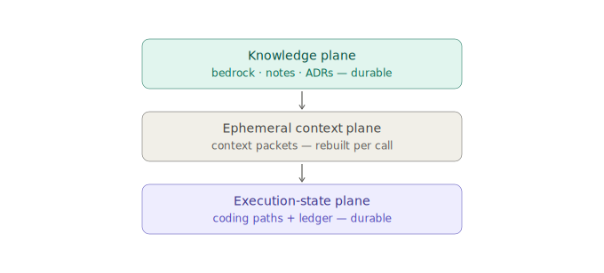
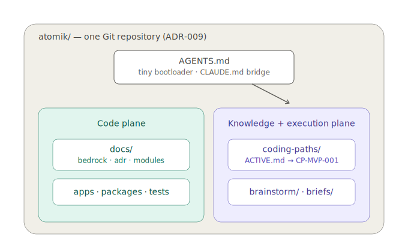

---
{
  "id": "35-coding-path-execution-state",
  "title": "Coding paths, work ledger, and the execution-state plane",
  "status": "foundational",
  "tags": [
    "agent",
    "coding-path",
    "work-ledger",
    "execution-state",
    "context",
    "bootstrap",
    "dual-plane",
    "git",
    "docs"
  ],
  "relations": [
    { "to": "22-agent-handoff", "kind": "implemented-by" },
    { "to": "26-okf-agent-context", "kind": "extends" },
    { "to": "17-self-evolving-docs", "kind": "governed-by" },
    { "to": "27-git-compatibility", "kind": "constrained-by" },
    { "to": "24-doc-templates", "kind": "uses" },
    { "to": "25-use-cases", "kind": "pressure-tested-by" }
  ],
  "agent": {
    "purpose": "Give implementation work a durable, file-backed execution state so no task depends on a chat thread, a context window, or a compressed brief as its primary memory.",
    "inputs": [
      "implementation task",
      "bedrock documents",
      "repository state",
      "tests",
      "active coding path",
      "work ledger checkpoint"
    ],
    "outputs": [
      "coding path file",
      "work ledger checkpoint",
      "documentation coverage record",
      "session resume point",
      "generated brief"
    ],
    "invariants": [
      "Bedrock states what the architecture should be; code and tests state what currently is; a coding path states what this task will change, in what order, and where it stands.",
      "A coding path references complete documents; it never replaces them with compressed summaries.",
      "Every relevant document is either selected or explicitly excluded with a reason; hidden omission is forbidden.",
      "Progress persists in files, never only in a conversation thread.",
      "A context window is an execution buffer, not durable memory.",
      "A brief is a generated, disposable view of path state, never the primary memory.",
      "Interactive path artifacts are projections; updating them patches the path file.",
      "The design remains correct regardless of any provider's session, context, or instruction-size limits; such figures are never load-bearing."
    ]
  }
}
---

# Coding paths, work ledger, and the execution-state plane

## The missing plane



Until v0.6, Atomik modeled two planes and left a third implicit:

```text
knowledge plane
  bedrock docs, ADRs, notes, source dossiers
  = what the architecture and project knowledge SHOULD BE

ephemeral context plane
  context packets, prompts, one conversation
  = what one operation is currently looking at

execution-state plane          <- previously missing
  coding paths, work ledger checkpoints
  = what this task WILL CHANGE, in what order, and where it stands
```

Reading the bedrock cannot tell an agent the current branch, the partially implemented feature, the failing test, or the exact next action. Code and tests cannot tell it the intended route. The conversation thread knows both — and evaporates. The execution-state plane makes that state durable.

## Five layers

```text
Bedrock       constitution and architectural map
AGENTS.md     small bootloader: where to start reading
Coding Path   the selected implementation route for one bounded task
Work Ledger   the persistent execution checkpoint inside the path
Brief         generated, human-readable snapshot for handoff only
```

The compressed brief is demoted, not deleted. It is a portable *view* generated from path state when work moves between sessions, agents, or people. It is never the primary memory.

## What a context window guarantees

A large context window is an execution buffer, not project memory. Documents are not active merely because they would fit; long sessions may be compacted; instruction files may be size-limited. Exact figures are volatile provider facts, and — by design — none of them are load-bearing here: the mechanism below stays identical whatever they are.

The achievable guarantee is therefore not:

```text
"every document remains simultaneously in attention"
```

It is:

```text
no durable state is lost
every omitted area is visible, with a reason
exact context can be reloaded at any time from files
```

## Coding path anatomy

A coding path is one Markdown file in `atomik-project/coding-paths/`.

```md
---
type: Atomik Coding Path
title: Implement project bundle open/create
atomik:
  id: CP-EXAMPLE-001
  status: active            # draft | active | blocked | done | archived
  current_step: S03
  base_commit: 7c91e20
---

# Goal

# Definition of done

# Documentation coverage

## Required
## Conditional
## Deliberately excluded

# Execution

- [x] S01 ...
- [>] S02 ...
- [ ] S03 ...

# Current checkpoint

# Blockers
```

The full template lives in `24_24-doc-templates.md`.

## Documentation coverage: no hidden areas

The coverage section is the durable, human-authored sibling of the `ContextPacket.omitted` field from `26_26-okf-agent-context.md`. The same rule, promoted from machine-ephemeral to file-durable:

```text
Required
  documents (or anchored sections) that must be read before executing

Conditional
  documents read only when a named trigger fires
  e.g. "13-electron-security before adding any new IPC channel"

Deliberately excluded
  documents intentionally out of scope, each with a reason
  e.g. "19-dsl-future — outside this milestone"
```

An agent does not have to read everything. It is forbidden to *silently* skip anything.

## Work ledger

The Work Ledger is the checkpoint that survives compaction, session ends, and device changes. For the MVP it is simply the `Current checkpoint` section of the path file:

```text
base commit
changed files
test state (unit / integration, passing or not run)
next action
blockers and pending decisions
```

An optional machine sidecar (`CP-XXX.state.json`) may mirror the checkpoint for tooling, following the standard sidecar rule: precision and performance support only, never the sole home of the state.

## Session protocol

```text
quick task
  one coding path, completed in one session

larger work
  a parent path containing sequential child paths
  or one child path per Git worktree

every new session
  resumes from the persisted checkpoint
  never reconstructs progress from conversation history
```

The step-by-step re-entry procedure is `22_22-agent-handoff.md`, which is now a bootstrap protocol rather than a static recipe.

## Path register

`coding-paths/index.md` maps every roadmap milestone to a path status — active, reserved, or not yet opened. Paths are created just-in-time from the milestone and the template, never speculatively; no milestone is silently unassigned. The completeness rule is fractal: the roadmap accounts for the vision, the register accounts for the roadmap, and each path accounts for its own documents.

## Interactive artifacts are projections

Atomik may render an active coding path as a progress bar, macro checklist, dependency view, changed-file list, test panel, or resume button. The invariant is identical to the canvas and Truth Lens rules:

```text
files contain the state
the artifact arranges and edits references to it
updating the artifact patches CP-XXX.md (and optionally its sidecar)
closing the artifact loses nothing
```

## Dual-plane repository



Atomik-the-project uses **one Git repository with two visible planes**:

```text
atomik/
  .git/
  AGENTS.md

  apps/                     # code plane
  packages/
  tests/
  docs/
    bedrock/
    adr/
    modules/

  atomik-project/           # knowledge + execution plane
    index.md
    log.md
    brainstorm/             # explicitly provisional thinking
    briefs/                 # generated handoff snapshots
    coding-paths/
      ACTIVE.md
      CP-MVP-001.md
    sessions/               # optional session notes
    sources/                # optional imported specs/references

  .atomik/                  # rebuildable only
```

Rules:

```text
atomik-project/ is an ordinary Atomik project bundle
  editable in Atomik like a vault project, consumable directly by coding agents

accepted ADRs stay canonical in docs/adr/
  atomik-project/brainstorm/ holds provisional thinking that may be promoted;
  durable decisions and dated facts never live only in brainstorm/

no nested Git repository or submodule by default
  nesting splits agent guidance discovery and breaks atomic code+docs commits;
  revisit only if the planes ever need separate access control
```

The decision record is `ADR-009`.

## Lifecycle and Git

Coding paths are committed by default. A finished path moves to `status: done`, then `archived` (or `coding-paths/archive/`) — demotion, never deletion, consistent with the note lifecycle in `11_11-markdown-page-model.md`. Ledger updates should be small appends; one executed step should read as one meaningful diff.

## Start as one file

The cheapest sufficient path applies to this mechanism itself. The Coding Path begins as a single Markdown file and a nine-step protocol. No framework, no runner, no database. Structure is added only when real multi-path work demonstrates the need.
