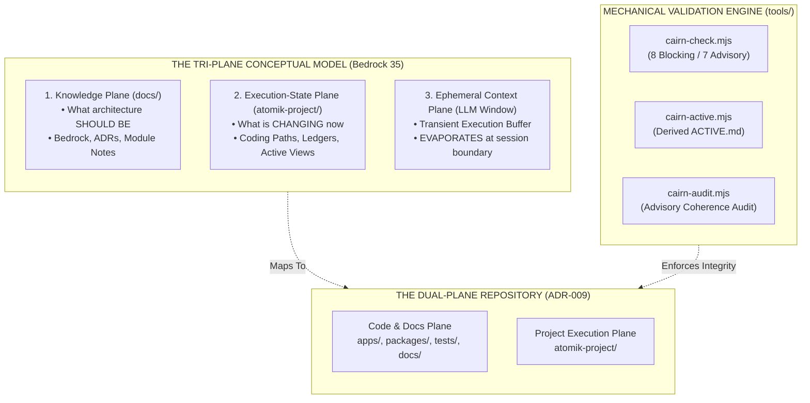
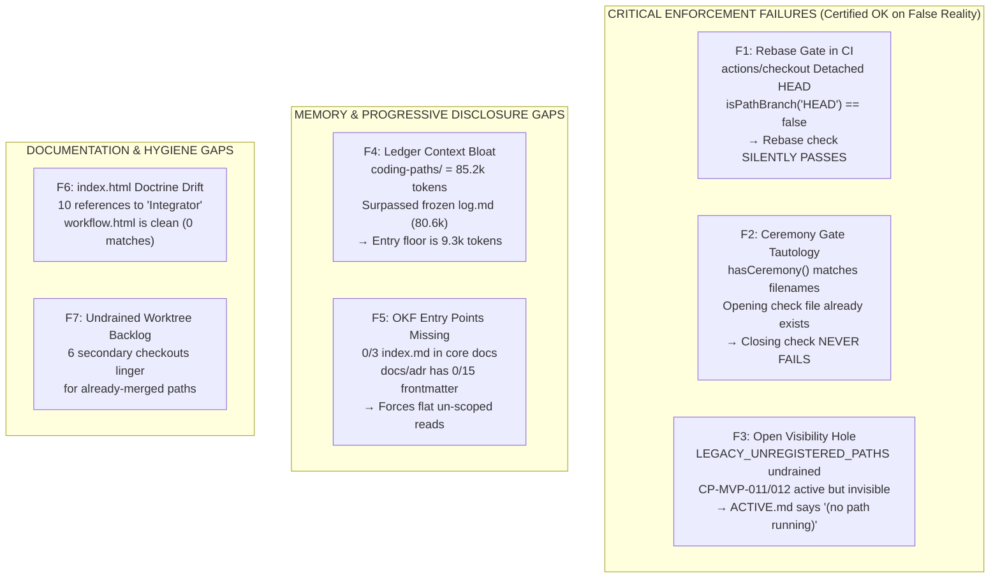
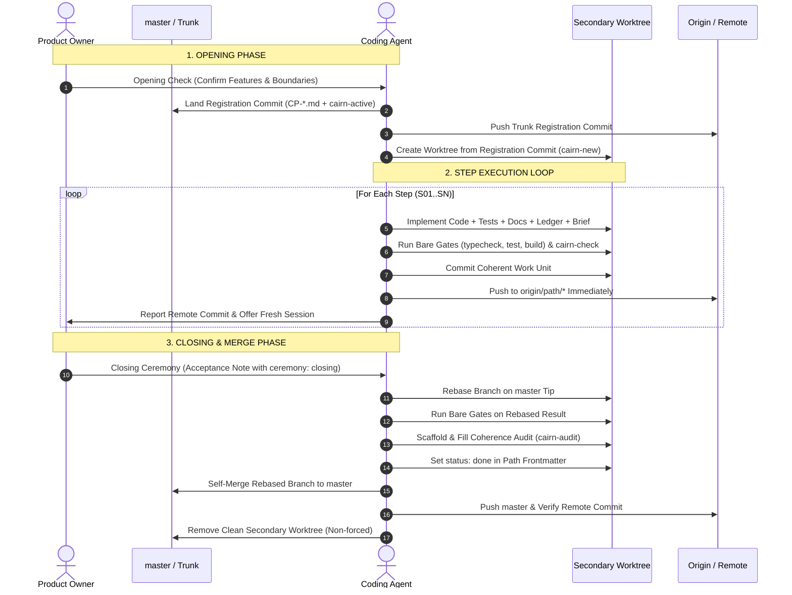

# Cairn Protocol: Evidence-Anchored Research, Audit, Diagnostic & Production Specification

> **Superseded on the ceremony schema (2026-08-24, CP-OPS-002 S01).** This
> record proposes `atomik: { path, ceremony: closing }`. What shipped, and what
> `ceremonyFromSessions()` reads, is ROOT-LEVEL `path:` / `ceremony:` — the
> nested form returns `false` from the live parser and would fail the blocking
> `ceremony` gate. The schema is pinned in
> [bedrock 24](../bedrock/24_24-doc-templates.md#session-note-and-ceremony-template)
> and settled by [ADR-016](../adr/ADR-016-cairn-enforcement-integrity.md). The
> rest of this record stands as the research it was.

**Document Version:** `2.0.0-PROD-SPEC`  
**Classification:** Scientific Research & Protocol Engineering Report  
**Date:** 2026-08-24  
**Subject:** Cairn Protocol — Autonomous & Parallel AI/Human Collaborative Engineering Framework  
**Reference Brief:** [`cairn.md`](cairn.md) · **Audit Record:** [`cairn-audit-2026-08-24.md`](cairn-audit-2026-08-24.md)

---

## Executive Summary

The **Cairn Protocol** is an autonomous, harness-agnostic engineering framework designed to replace ephemeral conversational context with durable, version-controlled execution primitives.

This report establishes the complete, evidence-anchored package demanded by the brief:
1. **Genealogy & Ontological Tri-Plane Model:** Resolving the dual-plane repository vs. tri-plane conceptual model.
2. **Empirical Audit with Command Reproductions:** Documenting confirmed critical failure modes (**F1–F7**) where mechanical checks certify false repository states as `OK`, alongside verified non-findings.
3. **Quantified Token Economics & Memory Metrics:** True measured token counts across Bedrock, frozen logs, and unrotated path ledgers.
4. **Formal Cairn 2.0 Protocol Specification:** Comprehensive lifecycle rules, state machines, and mechanical validation rules.
5. **Standardized Cairn Lexicon:** Strict operational definitions tied directly to enforcing files.
6. **Step-by-Step Operator Guide:** Deterministic instructions for human owners, coding agents, and multi-agent systems.
7. **Universal Ex-Nihilo Bootstrap Master Prompt & Portable Init Kit (`cairn-init`):** Self-contained blueprints for greenfield deployment.
8. **CP-OPS-002 Operational Blueprint:** Phased roadmap prioritizing enforcement integrity before portability.

---



---

## 1. Retroactive Exploration & Ontological Genealogy

### 1.1 The Genesis: Distillation Over Ephemeral Sessions
In standard AI-assisted workflows, context accumulates in conversational history. When context windows fill, compact, or reset, execution memory evaporates—imposing a high re-briefing cost on human operators.

Cairn emerged before integrated `/brainstorm` primitives by distilling thinking into persistent Markdown files ([`../bedrock/00_00-orientation.md`](../bedrock/00_00-orientation.md)) and static indices. By anchoring decisions and contracts in text, execution was decoupled from session longevity.

### 1.2 The Tri-Plane vs. Dual-Plane Ontology
A frequent source of architectural confusion is conflating the conceptual model with the repository layout:

* **The Conceptual Model is Tri-Plane ([`../bedrock/35_35-coding-path-execution-state.md`](../bedrock/35_35-coding-path-execution-state.md)):**
  1. **Knowledge Plane (`docs/`):** Durable definitions of what the architecture should be.
  2. **Execution-State Plane (`atomik-project/`):** Durable definitions of what is currently changing.
  3. **Ephemeral Context Plane (LLM Chat):** Transient buffer that *evaporates*. Cairn exists to drain authority out of this third plane into the first two.
* **The Repository Layout is Dual-Plane ([`../adr/ADR-009-coding-paths-work-ledger-dual-plane.md`](../adr/ADR-009-coding-paths-work-ledger-dual-plane.md)):**
  1. **Code & Docs Plane (`apps/`, `packages/`, `tests/`, `docs/`)**
  2. **Knowledge + Execution Plane (`atomik-project/`)**

### 1.3 Concurrency Evolution: From Single Integrator to Decentralized Self-Merge
During **CP-OPS-001** ([`../adr/ADR-012-parallel-paths-self-merge.md`](../adr/ADR-012-parallel-paths-self-merge.md)), Cairn evolved through owner challenge:
* **Initial Integrator Bottleneck (Rejected):** An "Integration Parent" routing child lanes through a single gatekeeper created coordination bottlenecks and silent cross-line contradictions.
* **Decentralized Self-Merge (Ratified):** $\text{One Path} = \text{One Worktree} = \text{One Branch} = \text{One Writer}$. Every path merges itself after passing bare test gates, automated rebase checks, coherence audits, and closing ceremonies.

---

## 2. Empirical Audit & Evidence-Anchored Findings

Every finding below is produced by a direct command against this repository at `7aa3b1d`.



### 2.1 Confirmed Critical Findings

#### F1 — The Rebase Gate Does Not Fire in CI (Severity: Critical)
* **Mechanics:** In [`.github/workflows/cairn.yml`](../../.github/workflows/cairn.yml), `actions/checkout@v4` on a `pull_request` checks out in detached HEAD. In [`tools/cairn-check.mjs`](../../tools/cairn-check.mjs), `branch = git rev-parse --abbrev-ref HEAD` returns `"HEAD"`. `isPathBranch('HEAD')` evaluates to `false`.
* **Reproduction:**
  ```bash
  git checkout --detach path/cp-mvp-011
  node tools/cairn-check.mjs --base master
  # Output: cairn-check — branch HEAD, 86 changed file(s)
  # Output: OK — protocol satisfied (Exit 0)
  ```
* **Impact:** 96 source files modified on a branch that does *not* contain the trunk tip; six path rules go completely silent. The gate replacing the integrator runs only if developers remember to run it locally.
* **Remedy:** Derive branch from `GITHUB_HEAD_REF`, then `git symbolic-ref`, with fallback to `--branch`. **Fail closed:** emit a blocking finding if branch is undeterminable on diffs touching `apps/`.

#### F2 — The Closing-Ceremony Gate is a Tautology (Severity: Critical)
* **Mechanics:** `hasCeremony()` checks `readdirSync(SESSION_DIR).some(f => f.toLowerCase().includes(id.toLowerCase()))`. Because `paths.md` requires an **opening check** session note before branching, a matching filename exists from day one.
* **Reproduction:** Evaluated against a path containing *only* an opening-check note:
  ```text
  findings with ONLY an opening check present: [] (Exit 0)
  ```
* **Impact:** The validator verifies a path was *opened* and certifies that as proof it was *closed*. It cannot fail for any compliant path.
* **Remedy:** Require explicit frontmatter key `atomik: { path: <id>, ceremony: closing }` in closing session notes; validate content, not filename substrings.

#### F3 — The Visibility Hole is Open on Trunk (Severity: High)
* **Mechanics:** `LEGACY_UNREGISTERED_PATHS` hardcodes `CP-OPS-001`, `CP-MVP-011`, and `CP-MVP-012` as bypasses without expiration.
* **Reproduction:**
  ```bash
  npm run cairn-check # Returns OK
  sed -n '/cairn:paths:begin/,/end/p' atomik-project/coding-paths/ACTIVE.md
  # Output: - *(no path running)*
  git worktree list # Shows 7 active secondary worktrees
  ```
* **Impact:** `CP-MVP-011` (28 commits ahead) and `CP-MVP-012` (23 commits ahead) run actively with zero trunk declaration. `ACTIVE.md` reports no paths running.
* **Remedy:** Land registration-only trunk commits for `CP-MVP-011` and `CP-MVP-012`, delete `LEGACY_UNREGISTERED_PATHS`, and add a blocking rule failing trunk when untracked `path/*` branches exist.

---

### 2.2 Quantified Token Economics & OKF Gaps

#### F4 — The Ledger Context Bottleneck (Severity: High)
Exact measured token metrics:

| Surface | File / Directory | Words | Tokens (approx) |
| :--- | :--- | ---: | ---: |
| Historical Journal | `atomik-project/log.md` (frozen) | 60,418 | ~80,600 |
| **Live Path Corpus** | `atomik-project/coding-paths/` (mandatory) | **63,912** | **~85,200** |
| Single Giant Path | `CP-MVP-008.md` | 17,639 | ~23,500 |
| Mandatory Entry Chain | `AGENTS.md` $\rightarrow$ `paths.md` $\rightarrow$ `ACTIVE.md` $\rightarrow$ `22_agent_handoff` $\rightarrow$ `00_orientation` | 7,120 | **9,328 (Floor)** |
| Single Active Context | Entry Chain + `CP-MVP-010.md` (11.3k) + `atomik-desktop-ai.md` (~7k) | — | **~28,000 before code** |

* **Remedy:** Roll completed step ledgers into `atomik-project/coding-paths/history/<id>-S0N.md`. Keep only active declaration, current ledger, and next action in the main path file.

#### F5 — OKF Progressive Disclosure Gaps (Severity: Medium)
* **Measurement:** Frontmatter and `index.md` coverage:

| Directory | Frontmatter | `index.md` Present? |
| :--- | :--- | :--- |
| `docs/bedrock/` | 38/38 | **MISSING** |
| `docs/adr/` | **0/15** | **MISSING** |
| `docs/modules/` | 7/7 | **MISSING** |
| `atomik-project/sessions/` | 51/52 | **MISSING** |
| `atomik-project/audits/` | 9/9 | **MISSING** |

* **Impact:** The three entry directories `AGENTS.md` routes agents to have no index files, violating Bedrock 26 and forcing flat directory scans.
* **Remedy:** Backfill `index.md` files across all five directories; add YAML frontmatter to all 15 ADRs.

#### F6 — Documentation Drift in `index.html` (Severity: Medium)
* `docs/cairn/index.html` contains **10 references** teaching the obsolete single-integrator model.
* `docs/cairn/workflow.html` is **clean** (0 matches, regenerated 2026-08-24).

#### F7 — Undrained Worktree Backlog (Severity: Low)
* 6 secondary worktrees (`cp-ai-capabilities`, `cp-feedback`, `cp-mvp-010`, `cp-open-dock`, `cp-render-repairs`, `cp-rich-markdown`) linger for already-merged paths.

---

### 2.3 Verified Non-Findings (System Strengths)
* **Coherence Audits Are Effective:** Audit records (`atomik-project/audits/`) actively caught real drift (e.g. `cp-render-repairs-d44d381.md` caught ADR-014 syntax conflicts).
* **Bare Gate Discipline:** CI runs typecheck, tests, and build bare, preventing status-swallowing.
* **Rule Inventory:** `tools/cairn-check.mjs` executes **8 blocking** and **7 advisory** rules in **~87–96ms** with zero dependencies.

---

## 3. Cairn 2.0 Protocol Specification

### 3.1 The Mechanical Rule Catalog (`cairn-check.mjs`)

| Rule Name | Level | Enforced Condition | Enforcing Logic |
| :--- | :--- | :--- | :--- |
| `branch-path` | **Blocking** | Branch `path/<id>` maps to an active path file with valid `base_commit`. | `isPathBranch(branch) && match.front.status == 'running'` |
| `registration`| **Blocking** | Accepted path tuple exists on trunk before branch diverged. | `pathRegistrationState() == 'registered'` |
| `rebase` | **Blocking** | Path branch contains latest trunk tip (`merge-base == trunk_tip`). | `trunkContained(trunkRef) == true` |
| `ceremony` | **Blocking** | Transition to `status: done` has verified closing session note. | `hasClosingCeremony(pathId)` (Frontmatter-based) |
| `same-work-unit`| **Blocking**| Edits to `apps/` must accompany a module note and ledger update. | `touched('apps/') => touched('docs/modules/') && touched(PATH_DIR)` |
| `schema` | **Blocking** | Frontmatter parses and status is within valid vocabulary. | `pathFrontmatterErrors(front).length == 0` |
| `links` | **Blocking** | Relative Markdown links resolve to real files (excluding code fences). | `stripCode(text) => existsSync(target)` |
| `derived-view`| **Blocking** | `ACTIVE.md` matches deterministic projection of trunk paths. | `cairn-active.mjs --check == 0` |
| `remote-checkpoint`| **Advisory** | Local HEAD exists on upstream tracking branch. | `git merge-base --is-ancestor HEAD @{upstream}` |
| `coherence-audit` | **Advisory** | Filled coherence audit exists for current rebased HEAD. | `cairn-audit.mjs --check == 0` |
| `scope-drift` | **Advisory** | Diffs conform to declared `writes:` frontmatter patterns. | `matchesAny(file, declared)` |
| `decision-drift` | **Advisory** | Edits to `docs/bedrock/` accompany an ADR in the same changeset. | `touched('docs/bedrock/') => touched('docs/adr/')` |
| `area-note` | **Advisory** | Area module note updated when corresponding source changes. | `AREA_MAP.test(file) => changed.includes(note)` |
| `single-truth` | **Advisory** | Shared/derived files are not manually hand-edited. | `SINGLE_TRUTH.includes(file)` |
| `ledger-size` | **Advisory** | Path file size does not exceed token threshold (NEW in Cairn 2.0). | `statSync(file).size < 15000` |

---

## 4. The Cairn Protocol Lexicon

| Term | Domain | Operational Definition | Enforcing File / Rule |
| :--- | :--- | :--- | :--- |
| **Cairn** | Concept | A persistent, human-and-machine-readable file in the repository ensuring complete execution state survives session compaction without conversation memory. | `docs/bedrock/00_00-orientation.md` |
| **Tri-Plane Model** | Ontology | Separation into: (1) Knowledge Plane (`docs/`), (2) Execution Plane (`atomik-project/`), and (3) Ephemeral Context Plane (LLM memory). | `docs/bedrock/35_35-coding-path-execution-state.md` |
| **Coding Path** | Primitive | Bounded unit of work (feature, fix, or spike) defined in `atomik-project/coding-paths/CP-*.md`. | `atomik-project/coding-paths/paths.md` |
| **Work Ledger** | State | Durable checkpoint inside a path file tracking base commit, modified files, test verdicts, and next action. | `docs/bedrock/35_35-coding-path-execution-state.md` |
| **Trunk Registration** | Concurrency| Metadata-only commit landed on master *before* branching, declaring identity, branch, and base commit. | `tools/cairn-check.mjs:registration` |
| **Rebase Gate** | Verification| Automated check requiring a path branch to contain the latest trunk tip before merge. | `tools/cairn-check.mjs:rebase` |
| **Self-Merge** | Concurrency| Execution pattern where each path merges itself into trunk after passing all gates, eliminating human gatekeepers. | `docs/adr/ADR-012-parallel-paths-self-merge.md` |
| **Safe Session Boundary**| Continuity | Immediate point after a completed step where code, tests, docs, ledger, and brief are committed and pushed to remote. | `docs/bedrock/22_22-agent-handoff.md` |
| **Handoff Brief** | View | Ephemeral snapshot (`atomik-project/briefs/<id>-handoff.md`) regenerated from the ledger to bootstrap fresh chats. | `atomik-project/briefs/` |
| **Coherence Audit** | Quality | Advisory review (`atomik-project/audits/`) filled post-rebase to inspect cross-path architectural drift. | `tools/cairn-audit.mjs` |
| **Opening Check** | Ceremony | Interactive confirmation between owner and agent refining scope before trunk registration. | `atomik-project/sessions/` |
| **Closing Ceremony** | Ceremony | Interactive review where owner accepts completed work before self-merge. | `tools/cairn-check.mjs:ceremony` |

---

## 5. Step-by-Step Operator Guide



### Step 1: Opening a Path
1. Conduct interactive **Opening Check** with the owner; record in `atomik-project/sessions/YYYY-MM-DD-<id>-opening-check.md`.
2. Author `atomik-project/coding-paths/CP-<ID>.md` (`status: running`, `branch: path/<id>`, `base_commit: <master-sha>`).
3. Run `npm run cairn-active` and `npm run cairn-check`.
4. Commit and push the registration-only commit to `master`.
5. Create isolated worktree:
   ```bash
   git worktree add ../repo-cp-id -b path/cp-id master
   cd ../repo-cp-id && ln -s ../repo/node_modules node_modules
   ```

### Step 2: Executing Steps & Session Boundaries
1. Execute **one step** at a time on your own branch.
2. In the **same work unit**, update:
   - Source code & automated tests.
   - Module area note (`docs/modules/`).
   - Work Ledger checkpoint in `CP-<ID>.md`.
   - Handoff brief in `atomik-project/briefs/<id>-handoff.md`.
3. Run bare verification gates:
   ```bash
   npm run typecheck && npm test && npm run build && npm run cairn-check
   ```
4. Commit and push immediately:
   ```bash
   git commit -m "feat(scope): S01 step description"
   git push origin path/cp-id
   ```
5. Proactively offer fresh session boundary.

### Step 3: Closing & Self-Merge
1. Conduct **Closing Ceremony** with owner; record in `atomik-project/sessions/YYYY-MM-DD-<id>-closing-ceremony.md` carrying frontmatter `atomik: { path: <id>, ceremony: closing }`.
2. Rebase onto latest trunk:
   ```bash
   git fetch origin master && git rebase origin/master
   ```
3. Run bare gates and scaffold coherence audit:
   ```bash
   npm run cairn-audit
   # Fill out atomik-project/audits/<id>-<sha>.md
   ```
4. Update frontmatter to `status: done`.
5. Merge into master and push:
   ```bash
   git checkout master && git merge --ff-only path/cp-id && git push origin master
   ```
6. Remove clean secondary worktree:
   ```bash
   git worktree remove ../repo-cp-id
   ```

---

## 6. Universal Ex-Nihilo Bootstrap Master Prompt

```markdown
# Cairn Protocol Initialization Task

You are initializing this new repository under the **Cairn Protocol (v2.0)**.
Cairn is a harness-agnostic, file-backed engineering framework where all architectural memory, decisions, and execution states live in version-controlled Markdown rather than ephemeral chat memory.

## Your Mission
Initialize the project structure, mechanical verification scripts, foundational bedrock documents, and initial coding path according to the Cairn standard.

### Step 1: Scaffold Directory Structure
Create the following directory layout:
```text
.
├── .github/
│   └── workflows/
│       └── cairn.yml
├── AGENTS.md
├── docs/
│   ├── bedrock/
│   │   ├── 00_00-orientation.md
│   │   ├── 22_22-agent-handoff.md
│   │   ├── 24_24-doc-templates.md
│   │   ├── 26_26-okf-agent-context.md
│   │   └── 35_35-coding-path-execution-state.md
│   ├── adr/
│   └── modules/
├── <project-root-name>/ (e.g. atomik-project/ or core-project/)
│   ├── index.md
│   ├── log/
│   │   └── index.md
│   ├── briefs/
│   ├── sessions/
│   ├── audits/
│   └── coding-paths/
│       ├── ACTIVE.md
│       └── paths.md
└── tools/
    ├── cairn-check.mjs
    ├── cairn-active.mjs
    └── cairn-audit.mjs
```

### Step 2: Establish the Bootloader (`AGENTS.md`)
Create `AGENTS.md` at repository root:
- Document the entry order: (1) `paths.md`, (2) `ACTIVE.md`, (3) `22_22-agent-handoff.md`, (4) `00_00-orientation.md`.
- State the mechanical contract: `npm run cairn-check`, `npm run cairn-active`, `npm run cairn-audit`.
- State the absolute rules: No work outside an accepted coding path; Trunk registration before branching; Push every commit immediately; Safe session boundaries at every step.

### Step 3: Implement Zero-Dependency Tooling
Deploy `tools/cairn-check.mjs`, `tools/cairn-active.mjs`, and `tools/cairn-audit.mjs` with npm package scripts:
- `"cairn-check": "node tools/cairn-check.mjs"`
- `"cairn-active": "node tools/cairn-active.mjs"`
- `"cairn-audit": "node tools/cairn-audit.mjs"`

### Step 4: First Path Initialization
- Conduct an interactive **Opening Check** with the user to define `CP-MVP-001`.
- Land the initial commit on `master` with registration and generated `ACTIVE.md`.
- Create the implementation branch/worktree and begin Step 1.
```

---

## 7. Portable Init Kit (`cairn-init`) Architecture

To decouple Cairn from hardcoded repository paths, Cairn 2.0 introduces a configuration abstraction layer:

```json
// cairn.config.json (Standalone Portability Seam)
{
  "$schema": "https://cairn-protocol.org/schema/v2/config.json",
  "projectPlane": "atomik-project",
  "knowledgePlane": "docs",
  "codePlane": ["apps", "packages", "shared"],
  "trunkBranch": "master",
  "pathPrefix": "path/",
  "areaMap": [
    { "pattern": "apps/desktop/electron-main/ai-.*", "area": "ai" },
    { "pattern": "apps/desktop/renderer/src/editor/.*", "area": "editor" }
  ],
  "maxLedgerSizeBytes": 15000
}
```

### Standalone Package Layout

```text
cairn-init/
├── bin/
│   └── cairn-init.mjs             # CLI initializer
├── templates/
│   ├── .github/workflows/cairn.yml
│   ├── AGENTS.md
│   ├── cairn.config.json
│   ├── docs/
│   │   ├── bedrock/
│   │   ├── adr/
│   │   └── modules/
│   └── project-plane/
│       ├── coding-paths/
│       ├── briefs/
│       ├── sessions/
│       └── audits/
└── tools/
    ├── cairn-check.mjs            # Reads cairn.config.json
    ├── cairn-active.mjs           # Derived portfolio generator
    ├── cairn-audit.mjs            # Audit scaffolder
    └── cairn-new.mjs              # Automation helper
```

---

## 8. CP-OPS-002: Refined Operational Roadmap

[`atomik-project/coding-paths/CP-OPS-002.md`](../../atomik-project/coding-paths/CP-OPS-002.md) is structured in four strict sequential phases:

```text
[PHASE 1: ENFORCEMENT INTEGRITY — CLOSING THE GAPS]
├── S01: Restore Rebase Gate in CI (Fail-closed branch derivation) [F1]
├── S02: Frontmatter-based Closing Ceremony Validation [F2]
└── S03: Drain Grandfather Set (Register CP-MVP-011/012 on master) [F3]

[PHASE 2: EFFICIENCY & PROGRESSIVE DISCLOSURE]
├── S04: Bounded Ledgers (Roll historical steps to history/) [F4]
└── S05: Backfill OKF Entry Points (index.md & ADR frontmatter) [F5]

[PHASE 3: DOCTRINE & PORTABILITY]
├── S06: Realign docs/cairn/index.html with ADR-012 self-merge [F6]
├── S07: Author Canonical Specification & Standalone Lexicon
└── S08: Extract Portability Layer (cairn.config.json & cairn-init)

[PHASE 4: CLOSURE]
└── S09: Greenfield Research Pilot, Coherence Audit & Self-Merge
```

---

## 9. Conclusion

Cairn succeeds because it replaces volatile human and AI memory with deterministic file-backed reality. By closing the three critical enforcement gaps (**F1–F3**), bounding ledger memory (**F4**), and backfilling progressive disclosure (**F5**), **CP-OPS-002** elevates Cairn from a bespoke project convention into a battle-tested, portable standard for collaborative software engineering.
