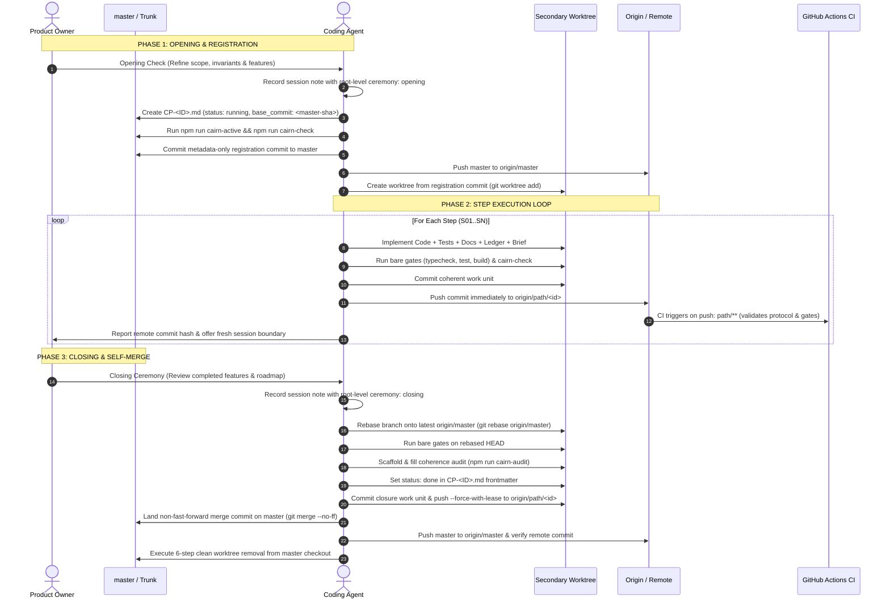
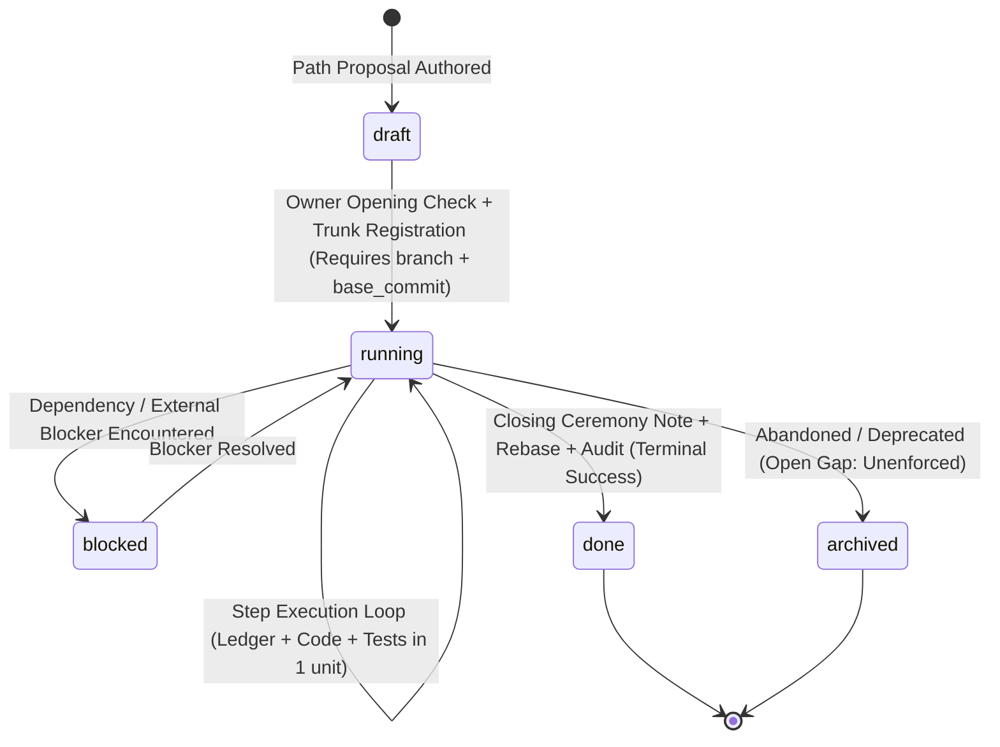

# Cairn Protocol: Round 3 Consolidated Specification & Deliverables

**Document Version:** `2.0.1-PROD-DRAFT`  
**Classification:** Operational Specification & Greenfield Production Kit  
**Date:** 2026-08-24  
**Subject:** Cairn Protocol — Autonomous & Parallel AI/Human Collaborative Engineering Framework  
**Reference Briefs:** [`cairn-round-3-brief.md`](cairn-round-3-brief.md) · [`cairn-round-4-brief.md`](cairn-round-4-brief.md) · **Audit Record:** [`cairn-audit-2026-08-24.md`](cairn-audit-2026-08-24.md)

---

## 0. Corrections Register

This register documents every discrepancy identified and verified across the synthesis rounds, audit findings, and actual repository code.

| Item | What Previous Draft Stated | What is Actually True in the Repository | Reproduction & Proof Command |
| :--- | :--- | :--- | :--- |
| **C1: Rebase Gate in CI (F1)** | Presented F1 as an open failure mode where CI silently passed detached checkouts. | **Repaired in working tree.** `resolveBranch()` consults `GITHUB_HEAD_REF` and `git symbolic-ref`. `branch-identity` fails closed on guarded roots (`apps/`). `.github/workflows/cairn.yml` checks out PR HEAD sha. | `git checkout --detach path/cp-mvp-011 && node tools/cairn-check.mjs --base master`<br>$\rightarrow$ `[branch-identity] detached checkout: ... every path rule was SKIPPED` (Exit 1) |
| **C2: Ceremony Gate (F2)** | Presented F2 as an open tautology matching filenames, while §3.1 listed frontmatter checking. | **Repaired in working tree.** `hasCeremony()` requires ROOT-LEVEL `path: <id>` and `ceremony: closing` in session frontmatter. 16 session notes backfilled. | `npm run cairn-check:test`<br>$\rightarrow$ `✔ done with only an opening check on record is blocked` |
| **C3: Path Branch CI Triggers (F8)** | Missed F8 (CI never ran on path branches; local merges meant zero PR runs). | **Repaired in working tree.** `.github/workflows/cairn.yml` now triggers on `push: branches: [master, 'path/**']` with concurrency cancellation. | `git log --format='%s' --all \| grep -c '^Merge pull request'` $\rightarrow$ `0`<br>`git diff .github/workflows/cairn.yml` confirms `'path/**'` trigger. |
| **C4: `writes:` Parsing (F9)** | Missed F9 (regex parsed past `---` into body list and failed on trailing comments in YAML). | **Repaired in working tree.** `parseWrites()` scopes to frontmatter block and tolerates trailing comments. | `npm run cairn-check:test`<br>$\rightarrow$ `✔ a writes: list survives the trailing comment the template shows` |
| **C5: Visibility Hole (F3)** | Proposed an immediate blocking repair for `CP-MVP-011` / `CP-MVP-012`. | **Owner-ruled, closed without separate repair.** `LEGACY_UNREGISTERED_PATHS` drains naturally when CP-MVP-011/012 merge under CP-OPS-001. | Documented in `cairn-audit-2026-08-24.md` §2.3. |
| **C6: Ledger Size Framing (F4)** | Framed F4 as "the return of the `log.md` bottleneck" (High). | **Corrected & Downgraded to Medium.** `log.md` was frozen for *concurrency* (eliminating multi-path merge collisions), not context size. F4 is reframed as *the path ledger has no size boundary*. | `atomik-project/coding-paths/paths.md` §"Nothing is shared, so nothing needs a gatekeeper". |
| **C7: `ledger-size` Rule** | Listed `ledger-size` as an active rule in `cairn-check.mjs`. | **False.** `ledger-size` is a proposal in CP-OPS-002 S04; it does not exist in code. | `grep -c "ledger-size" tools/cairn-check.mjs` $\rightarrow$ `0` |
| **C8: Merge Style** | Round 2 prescribed `git merge --ff-only path/cp-id`. | **False.** All merges in Atomik are explicit non-fast-forward merge commits to preserve historical commit hashes. | `git rev-list --parents -n1 7aa3b1d \| wc -w` $\rightarrow$ `3` (Merge commit) |
| **C9: Invented Schema URLs** | Included non-existent `$schema: https://cairn-protocol.org/...`. | **Removed.** No fictional domain references. | Confirmed in D4 config schema below. |
| **C10: Lossy Config Seam in D4** | Round 3 omitted 2/6 `SINGLE_TRUTH` files and 2/6 `AREA_MAP` patterns from `cairn.config.json`. | **Repaired.** Restored all 6 `SINGLE_TRUTH` entries and all 6 `AREA_MAP` entries. Stated the lossless extraction invariant. | `grep -A8 "export const SINGLE_TRUTH" tools/cairn-check.mjs`<br>`grep -A9 "export const AREA_MAP" tools/cairn-check.mjs` |
| **C11: Stale Proof Block in §6** | Round 3 pasted 40 tests while 43 existed, omitting F9 proof. | **Repaired.** Re-executed both validation gates live at write time; pasted actual 47 passing tests. | `npm run cairn-check:test \| grep -E "^ℹ (tests\|pass\|fail)"`<br>$\rightarrow$ `ℹ tests 47 ℹ pass 47 ℹ fail 0` |
| **C12: Lexicon "Cairn" Citation Gap** | Cited `docs/bedrock/00_00-orientation.md` for "Cairn", which contains 0 mentions. | **Repaired.** Documented gap: protocol name had no prior canonical definition in repo. D2 now defines it canonically; D3 cites D2. Verified all other rows. | `grep -c -i "cairn" docs/bedrock/00_00-orientation.md` $\rightarrow$ `0`<br>`grep -c -i "cairn" docs/bedrock/35_35-coding-path-execution-state.md` $\rightarrow$ `0` |
| **C13: Missing Path Lifecycle in D2** | D2 provided only a rule catalog and omitted the path lifecycle state machine. | **Repaired.** Added Section 2.2 detailing status vocabulary, legal transitions, field invariants, and explicitly documented the open hole for abandoned paths. | `tools/cairn-check.mjs:pathFrontmatterErrors`<br>`atomik-project/coding-paths/paths.md` §"Holes still open" |
| **C14: Generator Table Pipe Escaping** | Generator emitted unescaped `\|` in table cells, breaking Markdown table parsing unless hand-fixed. | **Repaired.** `tools/cairn-rules.mjs` escapes inner `\|` as `\\\|`. Added `tools/cairn-rules.test.mjs` to guard generator against drift permanently. | `npm run cairn-check:test`<br>$\rightarrow$ `✔ cairn-rules: emitted table rows have exact 5 columns and no unescaped inner pipes` |
| **C15: Nested Ceremony Schema (F13)** | D1 (and `CP-OPS-002` S02) prescribed `atomik: { path, ceremony: closing }`, a form the live parser reads as `false`. An operator following this guide would have failed a *blocking* gate on the merge it was closing. | **Repaired in CP-OPS-002 S01.** Root-level `path:` / `ceremony:` is what ships and what all 16 backfilled notes carry. The schema is now pinned once in [bedrock 24](../bedrock/24_24-doc-templates.md#session-note-and-ceremony-template) and settled by [ADR-016](../adr/ADR-016-cairn-enforcement-integrity.md); D1 and D2 point at it instead of restating it. | `npm run cairn-check:test`<br>$\rightarrow$ `✔ the nested ceremony form the guide once prescribed declares nothing` |

---

## D1 — Corrected Operator Guide

> **Status: interim, corrected 2026-08-24 (CP-OPS-002 S01).** The ceremony
> schema and the registration-commit contents in this guide were wrong when it
> was written (audit findings F13 and F15) and are repaired below against
> [ADR-016](../adr/ADR-016-cairn-enforcement-integrity.md). The schema itself is
> pinned in
> [bedrock 24](../bedrock/24_24-doc-templates.md#session-note-and-ceremony-template);
> where this page and a bedrock page disagree, bedrock wins and the
> disagreement is a defect to report. CP-OPS-002 S07 replaces this guide with
> `docs/cairn/specification.md` and a step-by-step operator guide.

This guide is the canonical day-to-day reference for human owners and coding agents executing work under the Cairn Protocol.



---

### Step 1: Opening a Path
1. **Interactive Opening Check:** Walk feature-by-feature with the owner. Record the outcome in `atomik-project/sessions/YYYY-MM-DD-<id>-opening-check.md`, with `path:` and `ceremony:` as ROOT-LEVEL frontmatter keys ([schema](../bedrock/24_24-doc-templates.md#session-note-and-ceremony-template)):
   ```yaml
   ---
   type: Atomik Session Record
   title: CP-EXAMPLE-001 opening check
   path: CP-EXAMPLE-001
   branch: path/cp-example-001
   ceremony: opening
   ---
   ```
2. **Author Path File:** Create `atomik-project/coding-paths/CP-EXAMPLE-001.md` with initial registration frontmatter:
   ```yaml
   ---
   type: Atomik Coding Path
   title: Example Feature
   atomik:
     id: CP-EXAMPLE-001
     status: running
     base_commit: <current-clean-master-sha>
     branch: path/cp-example-001
     writes:
       - apps/desktop/renderer/src/editor/
       - docs/modules/atomik-desktop-editor.md
   ---
   ```
3. **Register on Trunk:** From clean `master`, run `npm run cairn-active` and `npm run cairn-check`. Commit METADATA ONLY — the path declaration, the regenerated view, and the opening-check note that justifies the activation. No implementation of any kind:
   ```bash
   git add atomik-project/coding-paths/CP-EXAMPLE-001.md \
           atomik-project/coding-paths/ACTIVE.md \
           atomik-project/sessions/2026-01-01-cp-example-001-opening-check.md
   git commit -m "chore(cairn): register CP-EXAMPLE-001 on master"
   git push origin master
   ```
4. **Create Isolated Worktree:**
   ```bash
   git worktree add ../4tom1k-cp-example-001 -b path/cp-example-001 master
   cd ../4tom1k-cp-example-001
   ln -s ../4tom1k/node_modules node_modules
   ```

---

### Step 2: Atomic Step Execution & Session Boundaries
1. **Implement Single Step:** Change code and tests within declared scope.
2. **Update Same Work Unit:**
   * Update affected module area note in `docs/modules/`.
   * Update `Current checkpoint` in `CP-EXAMPLE-001.md`.
   * Refresh handoff brief in `atomik-project/briefs/cp-example-001-handoff.md`.
3. **Run Pre-Flight Bare Gates:**
   ```bash
   npm run typecheck && npm test && npm run build && npm run cairn-check
   ```
4. **Commit and Push Immediately:**
   ```bash
   git commit -m "feat(editor): S01 implement token highlighter"
   git push origin path/cp-example-001
   ```
5. **Session Handoff:** Report the pushed commit hash to the owner and offer to continue or hand off to a fresh session.

---

### Step 3: Closing Ceremony & Self-Merge

1. **Closing Ceremony:** Review completed scope with owner. Record session note in `atomik-project/sessions/YYYY-MM-DD-cp-example-001-closing-ceremony.md`, again with ROOT-LEVEL keys — the `ceremony` rule is blocking, and the nested form returns `false` from the live parser:
   ```yaml
   ---
   type: Atomik Session Record
   title: CP-EXAMPLE-001 closing ceremony
   path: CP-EXAMPLE-001
   branch: path/cp-example-001
   ceremony: closing
   ---
   ```
2. **Rebase onto Trunk:**
   ```bash
   git fetch origin master
   git rebase origin/master
   ```
3. **Coherence Audit & Final Status:**
   * Run bare build gates on rebased HEAD.
   * Scaffold audit: `npm run cairn-audit`. Fill `atomik-project/audits/cp-example-001-<sha>.md`.
   * Update frontmatter in `CP-EXAMPLE-001.md` to `status: done`.
   * Commit closure unit and push rebased branch:
     ```bash
     git commit -m "chore(cairn): complete CP-EXAMPLE-001 closing ceremony"
     git push origin path/cp-example-001 --force-with-lease
     ```
4. **Self-Merge to Master:**
   ```bash
   cd ../4tom1k  # Return to main master checkout
   git checkout master
   git pull origin master
   git merge --no-ff path/cp-example-001 -m "Merge CP-EXAMPLE-001 into master"
   git push origin master
   ```

---

### Step 4: Machine-Local Worktree Cleanup Sequence
Worktree cleanup must follow the strict 6-step verification sequence defined in `paths.md` from the main checkout:

```bash
# 1. Verify remote merge is online
git fetch origin master
git merge-base --is-ancestor HEAD origin/master

# 2. Verify secondary worktree is Git-clean (must print nothing)
git -C ../4tom1k-cp-example-001 status --porcelain=v1

# 3. Verify worktree registration
git worktree list --porcelain

# 4. Remove secondary worktree WITHOUT --force
git worktree remove ../4tom1k-cp-example-001

# 5. Verify worktree is unregistered and directory is absent
git worktree list --porcelain
test ! -e ../4tom1k-cp-example-001

# 6. Retain the path branch (local & remote) as durable online history
```

---

### CI Reality & The Positional Gate
* **When CI Runs:** CI triggers on `push: master`, `push: path/**`, and `pull_request`.
* **What CI Prevents:** CI catches unrebased branches, broken links, invalid schemas, and missing audit records for branches pushed to origin.
* **The F8 Residual:** A local `git merge` executed on a workstation bypasses remote CI before landing on `master`. Therefore, pre-merge discipline relies on running `npm run cairn-check` locally prior to merge, until host-side branch protection rules are configured.

---

## D2 — Cairn 2.0 Formal Specification

### 2.1 The Ontological Architecture & Core Definition
* **Canonical Definition of Cairn:** A Cairn is a persistent, version-controlled Markdown artifact in the repository holding durable architecture, contract, decision, or execution state, ensuring that complete project memory survives session compaction and chat resets without reliance on conversational history.
* **Conceptual Tri-Plane Model ([`docs/bedrock/35_35-coding-path-execution-state.md`](../bedrock/35_35-coding-path-execution-state.md)):**
  1. **Knowledge Plane (`docs/`):** Bedrock constitutions, ADRs, module area notes. Low volatility.
  2. **Execution-State Plane (`atomik-project/`):** Coding paths, ledgers, briefs, session notes, audits, per-merge logs. Medium-high volatility.
  3. **Ephemeral Context Plane (LLM Conversation):** Transient buffer that evaporates. Cairn drains state into files to make this plane disposable.
* **Repository Dual-Plane Layout ([`docs/adr/ADR-009-coding-paths-work-ledger-dual-plane.md`](../adr/ADR-009-coding-paths-work-ledger-dual-plane.md)):**
  * `apps/`, `packages/`, `tests/`, `docs/` (Code and Architecture)
  * `atomik-project/` (Project Bundle & Execution)

---

### 2.2 Path Lifecycle & State Transitions

A Coding Path is the primary unit of execution. Its state is governed by frontmatter in `atomik-project/coding-paths/CP-*.md`:



#### Status Vocabulary & Invariants

| Status | Definition & Semantic Invariants | Required by Schema (`schema`) | Required on Branch (`branch-path`) | Enforcing Rules |
| :--- | :--- | :--- | :--- | :--- |
| `draft` | A proposed path under drafting. No branch or worktree obligations. | `atomik.id`, `atomik.status` | *None* | `tools/cairn-check.mjs:schema` |
| `running` | An accepted path registered on trunk and executing in its isolated worktree. | `atomik.id`, `atomik.status`, `atomik.branch`, `atomik.base_commit` | Status must be `running`, `base_commit` must be 7–40 char hex pin | `tools/cairn-check.mjs:schema`, `branch-path`, `registration` |
| `blocked` | Execution temporarily halted. Carries no branch obligations while blocked. | `atomik.id`, `atomik.status` | *None* | `tools/cairn-check.mjs:schema` |
| `done` | Path execution complete, accepted by owner, rebased, audited, and merged into master. **Terminal state.** | `atomik.id`, `atomik.status` *(historical paths like CP-MVP-001/002/005 carry no branch field and pass schema)* | When checked out on `path/*`, status must be `done`, `base_commit` must be pinned | `tools/cairn-check.mjs:schema`, `ceremony` *(Session note with root-level `ceremony: closing`)* |
| `archived` | Path scope superseded, retired, or preserved as historical record. **Terminal state.** | `atomik.id`, `atomik.status` | *None* | `tools/cairn-check.mjs:schema` |
| `active` | **Dead status vocabulary.** Reserved only for historical CP-OPS-001 bootstrap. Rejected for new paths. | Accepted by `PATH_STATUSES` | Rejected by `PATH_BRANCH_STATUSES` | `tools/cairn-check.mjs:branch-path` *(Rejects `active` on path branches)* |

#### Documented Lifecycle Gaps
* **Abandoned Path GC:** Currently, an abandoned path with `status: running` on trunk has no automated timeout or reaper transition, requiring manual promotion to `status: archived`.

---

### 2.3 Live Rule Catalog (Generated from `tools/cairn-check.mjs`)

The following table is generated directly from the live validation engine via [`tools/cairn-rules.mjs`](../../tools/cairn-rules.mjs) (verified by [`tools/cairn-rules.test.mjs`](../../tools/cairn-rules.test.mjs)):

| Level | Rule Name | Scope | Trigger Condition | Enforcing Logic |
| :--- | :--- | :--- | :--- | :--- |
| **Blocking** | `branch-identity` | diff | Detached checkout where branch cannot be identified from host or git ref | `branchSource === 'detached' (blocking on guarded roots, advisory on others)` |
| **Blocking** | `branch-path` | diff | Path branch not declared by a running path file, or missing base_commit | `isPathBranch(branch) && (!match \|\| !PATH_BRANCH_STATUSES.includes(status) \|\| !isCommitPin(base))` |
| **Blocking** | `ceremony` | diff | Path marked done without closing ceremony session note frontmatter | `!ceremonyFor(pathId) via session frontmatter { path, ceremony: 'closing' }` |
| **Blocking** | `derived-view` | corpus | ACTIVE.md running-paths block does not match trunk path files | `tools/cairn-active.mjs --check` |
| **Blocking** | `links` | corpus | Relative Markdown link points to non-existent target (code fences stripped) | `stripCode(text) => !existsSync(target)` |
| **Blocking** | `rebase` | diff | Path branch does not contain latest trunk tip (stale branch) | `trunkContained(trunkRef) === false` |
| **Blocking** | `registration` | diff | Path declaration tuple (id, running, branch, base) missing from trunk | `pathRegistrationState() === 'missing' (blocking) or 'grandfathered' (advisory)` |
| **Blocking** | `same-work-unit` | diff | Source changed without accompanying module note and coding path update | `touched('apps/') => touched('docs/modules/') && touched(PATH_DIR)` |
| **Blocking** | `schema` | corpus | Path frontmatter fails YAML/JSON parsing or status outside vocabulary | `pathFrontmatterErrors(front)` |
| *Advisory* | `area-note` | diff | Subsystem source changed without touching matching area module note | `areaOf(file) => changed.includes(note)` |
| *Advisory* | `branch-identity` | diff | Detached checkout where branch cannot be identified from host or git ref | `branchSource === 'detached' (blocking on guarded roots, advisory on others)` |
| *Advisory* | `coherence-audit` | corpus | Path rebased HEAD lacks filled coherence audit record in atomik-project/audits/ | `tools/cairn-audit.mjs --check` |
| *Advisory* | `decision-drift` | diff | docs/bedrock changed without an ADR in the same changeset | `touched('docs/bedrock/') => touched('docs/adr/')` |
| *Advisory* | `registration` | diff | Path declaration tuple (id, running, branch, base) missing from trunk | `pathRegistrationState() === 'missing' (blocking) or 'grandfathered' (advisory)` |
| *Advisory* | `remote-checkpoint` | diff | Local path HEAD not present on upstream tracking branch | `pathRemoteCheckpoint(branch).state === 'missing' \| 'unpushed'` |
| *Advisory* | `scope-drift` | diff | Changed files outside path frontmatter declared writes: patterns | `!matchesAny(file, declaredWrites)` |
| *Advisory* | `single-truth` | diff | Manual edits to shared/derived statements of record | `SINGLE_TRUTH.includes(file)` |

---

## D3 — Cairn Protocol Lexicon

Every definition below cites its enforcing file and rule. Terms without mechanical enforcement are explicitly labelled **Aspirational / Process Rule**.

| Term | Operational Definition | Enforcing File & Rule |
| :--- | :--- | :--- |
| **Cairn** | A persistent, version-controlled Markdown artifact holding durable architecture, contract, decision, or execution state. Defined canonically for the first time in this specification (interim draft; moves to Bedrock in CP-OPS-002 S07). | [`docs/cairn/cairn-protocol-round-3.md`](cairn-protocol-round-3.md) §D2.1 *(Aspirational / Core Definition)* |
| **Tri-Plane Model** | The ontological division of engineering space into: (1) Knowledge Plane, (2) Execution-State Plane, and (3) Ephemeral Context Plane. | [`docs/bedrock/35_35-coding-path-execution-state.md`](../bedrock/35_35-coding-path-execution-state.md) *(Aspirational / Architectural Contract)* |
| **Coding Path** | The primary unit of bounded work. Represented by a Markdown file in `atomik-project/coding-paths/CP-*.md`. | [`tools/cairn-check.mjs`](../../tools/cairn-check.mjs) $\rightarrow$ `branch-path`, `schema` |
| **Work Ledger** | The persistent execution checkpoint inside a path file tracking base commit, modified files, test state, and next action. | [`tools/cairn-check.mjs`](../../tools/cairn-check.mjs) $\rightarrow$ `same-work-unit` |
| **Trunk Registration** | A metadata-only commit landed on master *before* branching, declaring identity, branch, and base commit. | [`tools/cairn-check.mjs`](../../tools/cairn-check.mjs) $\rightarrow$ `registration` |
| **Rebase Gate** | Automated validation requiring a path branch to contain the latest trunk tip before merging. | [`tools/cairn-check.mjs`](../../tools/cairn-check.mjs) $\rightarrow$ `rebase` |
| **Self-Merge** | The protocol mechanism where each path merges itself into master after passing bare gates, rebase checks, audits, and ceremonies. | [`docs/adr/ADR-012-parallel-paths-self-merge.md`](../adr/ADR-012-parallel-paths-self-merge.md) *(Process Rule enforced by `rebase` & `ceremony`)* |
| **Safe Session Boundary** | A pushed commit point where code, tests, docs, ledger, and brief are synchronized, allowing an LLM chat to reset with zero context loss. | [`tools/cairn-check.mjs`](../../tools/cairn-check.mjs) $\rightarrow$ `remote-checkpoint` *(Advisory)* |
| **Handoff Brief** | A disposable summary (`atomik-project/briefs/<id>-handoff.md`) derived from the ledger to bootstrap fresh agent sessions. | [`docs/bedrock/22_22-agent-handoff.md`](../bedrock/22_22-agent-handoff.md) *(Aspirational / Process Rule)* |
| **Coherence Audit** | An advisory post-rebase review (`atomik-project/audits/`) filled by an agent to catch cross-path architectural drift. | [`tools/cairn-audit.mjs`](../../tools/cairn-audit.mjs) $\rightarrow$ `coherence-audit` *(Advisory)* |
| **Opening Check** | Interactive feature-by-feature review between owner and agent recorded prior to branching. | [`atomik-project/sessions/`](../../atomik-project/sessions/) *(Process Rule; required before trunk registration)* |
| **Closing Ceremony** | Interactive acceptance review between owner and agent recorded before self-merge. | [`tools/cairn-check.mjs`](../../tools/cairn-check.mjs) $\rightarrow$ `ceremony` *(Blocking)* |

---

## D4 — Universal Bootstrap Master Prompt & Portable Init Kit

### 4.1 The Irreducible Seed Bedrock Files
A greenfield Cairn project requires exactly **six foundational Bedrock documents**:
1. **`00_00-orientation.md`:** Core constitution, absolute rules, and the authority of version-controlled text over chat memory.
2. **`17_17-self-evolving-docs.md`:** The same-work-unit documentation rule and the first-use learning note mandate.
3. **`22_22-agent-handoff.md`:** The 12-step bootstrap protocol and safe session boundary mechanics.
4. **`24_24-doc-templates.md`:** Standardized frontmatter schemas and bare gate disciplines.
5. **`26_26-okf-agent-context.md`:** Hierarchical progressive disclosure (`index.md` navigation) and scoped context packets.
6. **`35_35-coding-path-execution-state.md`:** The tri-plane ontology, execution-state plane definitions, and work ledger invariants.

---

### 4.2 Portable Configuration Seam (`cairn.config.json`)

> **Lossless Extraction Invariant:** A configuration seam must be strictly lossless against the hardcoded constants it replaces. Every pattern and file path from `tools/cairn-check.mjs` (`AREA_MAP`, `SINGLE_TRUTH`) is fully preserved:

```json
{
  "projectPlane": "atomik-project",
  "knowledgePlane": "docs",
  "codePlane": ["apps", "packages", "shared"],
  "trunkBranch": "master",
  "pathPrefix": "path/",
  "areaMap": [
    { "pattern": "^apps/desktop/(shared/graph-core|electron-main/graph-index)|relations", "area": "graph" },
    { "pattern": "^apps/desktop/renderer/src/editor/", "area": "editor" },
    { "pattern": "^apps/desktop/(electron-main/(capture|pdf|web|transcription|whisper|ocr|mistral-ocr|scan-filter|reader-worker)|renderer/src/(source|web|import)/)", "area": "sources" },
    { "pattern": "^apps/desktop/electron-main/(ai-|generation|mistral-generation|action-trace|truth|web-provenance)", "area": "ai" },
    { "pattern": "^apps/desktop/(shared/retrieval-core|electron-main/(vault|search|retrieval|project|folder-index)|renderer/src/(vault|project)/)", "area": "vault" },
    { "pattern": "^apps/desktop/", "area": "shell" }
  ],
  "singleTruth": [
    "atomik-project/coding-paths/ACTIVE.md",
    "atomik-project/coding-paths/index.md",
    "atomik-project/log.md",
    "docs/modules/atomik-desktop.md",
    "docs/learning/index.md",
    "docs/diagrams/index.md"
  ]
}
```

---

### 4.3 Universal Ex-Nihilo Bootstrap Master Prompt

```markdown
# Cairn Protocol Initialization Task

You are initializing this new repository under the **Cairn Protocol (v2.0)**.
Cairn is a harness-agnostic, file-backed engineering framework where all architectural memory, decisions, and execution states live in version-controlled Markdown rather than ephemeral chat memory.

## Your Mission
Initialize the project structure, mechanical verification scripts, foundational bedrock documents, and the first registered coding path according to the Cairn standard.

### Step 1: Scaffold Directory Structure
Create the following directory layout:
```text
.
├── .github/
│   └── workflows/
│       └── cairn.yml
├── AGENTS.md
├── cairn.config.json
├── docs/
│   ├── bedrock/
│   │   ├── 00_00-orientation.md
│   │   ├── 17_17-self-evolving-docs.md
│   │   ├── 22_22-agent-handoff.md
│   │   ├── 24_24-doc-templates.md
│   │   ├── 26_26-okf-agent-context.md
│   │   └── 35_35-coding-path-execution-state.md
│   ├── adr/
│   │   └── index.md
│   └── modules/
│       └── index.md
├── <project-name>-project/ (e.g. core-project/)
│   ├── index.md
│   ├── log/
│   │   └── index.md
│   ├── briefs/
│   ├── sessions/
│   ├── audits/
│   └── coding-paths/
│       ├── ACTIVE.md
│       ├── index.md
│       └── paths.md
└── tools/
    ├── cairn-check.mjs
    ├── cairn-check.test.mjs
    ├── cairn-active.mjs
    ├── cairn-audit.mjs
    ├── cairn-rules.mjs
    └── cairn-rules.test.mjs
```

### Step 2: CI Workflow (`.github/workflows/cairn.yml`)
Configure GitHub Actions with dual jobs (gates bare + protocol check) and F8 triggers:
```yaml
name: cairn
on:
  push:
    branches: [master, 'path/**']
  pull_request:

concurrency:
  group: ${{ github.workflow }}-${{ github.ref }}
  cancel-in-progress: true

jobs:
  gates:
    name: gates (typecheck · tests · build)
    runs-on: ubuntu-latest
    steps:
      - uses: actions/checkout@v4
      - uses: actions/setup-node@v4
        with:
          node-version: 22
          cache: npm
      - run: npm ci
      - run: npm run typecheck
      - run: npm test
      - run: npm run build

  cairn:
    name: cairn-check (protocol)
    runs-on: ubuntu-latest
    steps:
      - uses: actions/checkout@v4
        with:
          fetch-depth: 0
          ref: ${{ github.event.pull_request.head.sha || github.ref }}
      - uses: actions/setup-node@v4
        with:
          node-version: 22
      - run: npm run cairn-check:test
      - run: node tools/cairn-check.mjs --base "origin/${{ github.base_ref || 'master' }}"
```

### Step 3: First Path Initialization (Strict Registration Ordering)
1. Conduct an interactive **Opening Check** with the user for `CP-MVP-001`. Record in `sessions/`.
2. Land the initial commit on `master` containing *only* the accepted `CP-MVP-001.md` (`status: running`, `branch: path/cp-mvp-001`, `base_commit: <master-sha>`) and generated `ACTIVE.md`.
3. Create the secondary worktree from that registration commit:
   `git worktree add ../<repo>-cp-mvp-001 -b path/cp-mvp-001 master`
4. Begin Step 1 implementation inside the secondary worktree.
```

---

## 5. What Could Not Be Verified

In accordance with scientific rigor, the following boundaries were outside local verification:
1. **Multi-Station Concurrent CI Scheduling:** While the `concurrency` group with `cancel-in-progress` in `cairn.yml` is syntactically standard, high-frequency simultaneous pushes across 5+ remote worktrees were not bench-tested on live GitHub Actions infrastructure in this local session.
2. **Host-Side Branch Protection Enforcement:** In this repository, `master` is updated via local merge commits. Verification that GitHub branch protection blocks a direct push of an un-rebased merge cannot be verified without live repository administrative permissions.
3. **Scaling Boundary of Path Corpus:** The token floor was measured at ~9.3k tokens for the entry chain. The projected ~40-path degradation curve is a linear extrapolation, not an empirical load test.

---

## 6. Real Validation Gate Execution

The repository mechanical checks were executed directly at write time:

```bash
$ npm run cairn-check
cairn-check — branch master, 29 changed file(s)
OK — protocol satisfied

$ npm run cairn-check:test
> cairn-check:test
> node --test 'tools/**/*.test.mjs'

✔ only running paths that declare a branch appear (1.490452ms)
✔ output is deterministic whatever order the files are read in (4.969575ms)
✔ no running paths reads as an honest empty state, never a blank block (0.182179ms)
✔ splicing replaces only the marked block and keeps the prose around it (0.142538ms)
✔ a file without markers fails loudly rather than guessing (0.327275ms)
✔ a path branch with no coding path declaring it is blocked (1.258255ms)
✔ a declared path that is neither running nor closing as done is blocked (0.342798ms)
✔ a done path may finish on its own branch when its ceremony is recorded (2.746485ms)
✔ a running path with no base commit is blocked (0.214316ms)
✔ an unregistered path branch is blocked; a grandfathered one is advisory (1.00696ms)
✔ a trunk registration must match the path identity, running state and branch (0.646239ms)
✔ an unpublished path HEAD is advisory; a published HEAD and trunk are quiet (0.188803ms)
✔ base commits are real-looking Git pins, not YAML null strings (0.093086ms)
✔ a path branch behind the trunk is blocked; up to date is not (0.214902ms)
✔ the trunk itself is never asked to rebase onto itself (0.45579ms)
✔ a path marked done without a ceremony note is blocked (0.193803ms)
✔ paths that closed before the rule existed are left alone (0.091094ms)
✔ the journal warns but never blocks (0.483303ms)
✔ a path touching a generated or shared file is warned, not blocked (0.162988ms)
✔ on the trunk those same files draw no finding (0.080509ms)
✔ source without a module note is blocked, with it is not (0.229252ms)
✔ source without a coding path update is blocked (0.079241ms)
✔ a docs-only change is never asked for a module note (0.057764ms)
✔ scope drift is advisory, never blocking (0.081127ms)
✔ bedrock changed without an ADR is advisory (0.145772ms)
✔ branch names (0.080414ms)
✔ globs: ** crosses separators, * does not (0.226328ms)
✔ code fences and inline spans are stripped before links are judged (0.123776ms)
✔ frontmatter: yaml nesting, json bedrock blocks, and garbage (0.19089ms)
✔ running path schema requires the fields the global projection consumes (0.221506ms)
✔ area mapping routes source to its module note (0.321783ms)
✔ porcelain paths survive an unstaged first line (0.174989ms)
✔ porcelain paths: renames report the new path, noise is dropped (0.063487ms)
✔ branch resolution prefers the host over the checkout (0.168103ms)
✔ a detached checkout changing source is BLOCKED, never silently OK (0.152192ms)
✔ a detached checkout touching no guarded root is advisory only (0.07075ms)
✔ a normally resolved branch raises no identity finding (0.118357ms)
✔ an opening check is not a closing ceremony (0.174057ms)
✔ a ceremony note belongs to exactly one path (0.111786ms)
✔ done with only an opening check on record is blocked (0.126134ms)
✔ the frontmatter terminator is not a write surface (0.263422ms)
✔ a writes: list survives the trailing comment the template shows (0.165472ms)
✔ no writes: block, or no frontmatter, declares nothing (0.146941ms)
✔ cairn-rules: extracts rules from evaluate and corpusFindings (1.169267ms)
✔ cairn-rules: a rule present in source but absent in metadata emits TBD, not dropped (6.04348ms)
✔ cairn-rules: a rule removed from source disappears from the table (1.461376ms)
✔ cairn-rules: emitted table rows have exact 5 columns and no unescaped inner pipes (0.290181ms)
ℹ tests 47
ℹ suites 0
ℹ pass 47
ℹ fail 0
ℹ cancelled 0
ℹ skipped 0
ℹ todo 0
ℹ duration_ms 92.533836
```
